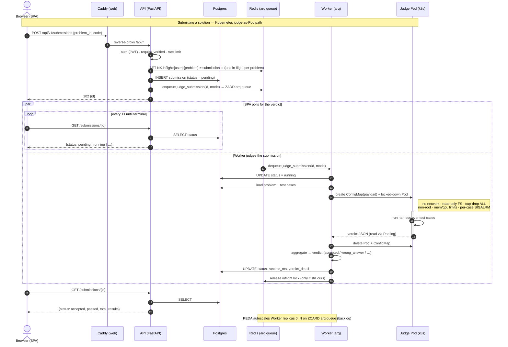
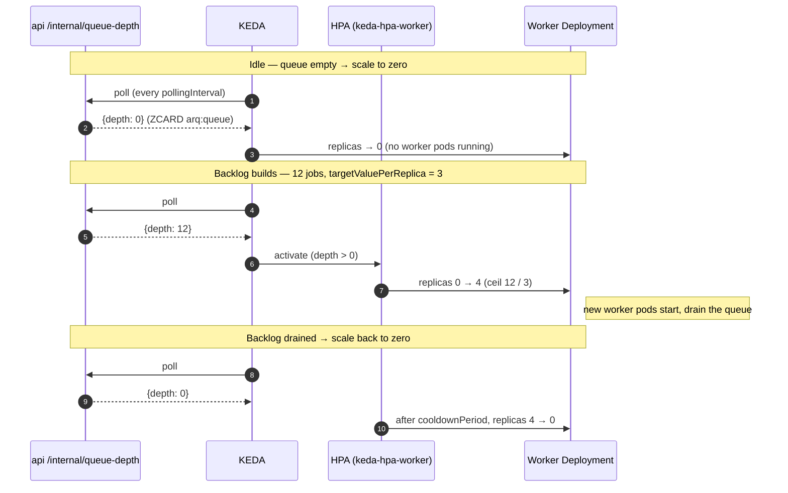
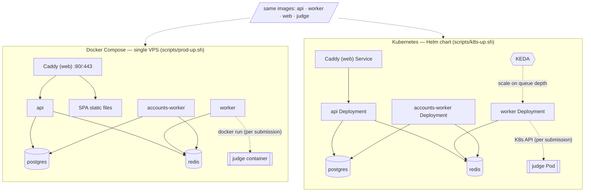

# Shikomi — Design Document

A self-hosted, open-source coding-practice platform. Users browse problems, write solutions in a browser editor (Python, JavaScript, or SQL), and submit them for automated judging against test cases in a sandboxed environment.

**Bring your own problems.** Shikomi ships the platform — judge, sandbox, accounts, workspace — plus five original starter problems that show the format. Everything else is the operator's: problems are JSON files loaded with `python -m app.cli seed --dir <path>` (§7.1). There is no bundled catalog, no authoring UI, and no paid tier (§12).

**Scope:** problems + judging, user accounts, editorial solutions with explanations, submission history.

**Non-goals:** contests, discussion forums, social features, leaderboards, custom test-case input on Run, multi-tenant problem authoring.

---

## 1. Architecture Overview

```
┌──────────┐     HTTPS      ┌─────────────┐
│ Browser  │ ─────────────► │   Caddy     │  (TLS termination, reverse proxy)
│ (React)  │                └──────┬──────┘
└──────────┘                       │
                                   ▼
                            ┌─────────────┐        ┌────────────┐
                            │  FastAPI    │ ◄────► │ PostgreSQL │
                            │  (api)      │        └────────────┘
                            └──────┬──────┘
                                   │ enqueue job
                                   ▼
                            ┌─────────────┐
                            │   Redis     │  (arq task queue)
                            └──────┬──────┘
                                   │ dequeue job
                                   ▼
                            ┌─────────────┐        ┌────────────┐
                            │ Judge worker│ ◄────► │ PostgreSQL │  (write verdict)
                            │ (arq)       │        └────────────┘
                            └──────┬──────┘
                                   │ per submission: `docker run`  (single host)
                                   │            or  a Kubernetes Pod (cluster)
                                   ▼
                            ┌─────────────┐
                            │  Sandbox    │  (ephemeral, no network,
                            │             │   resource-limited)
                            └─────────────┘
```

**Key principle:** the API never executes user code. It persists the submission, enqueues a job, and returns immediately. A separate judge worker dequeues jobs, runs the code in a throwaway sandbox, and writes the verdict back to Postgres. The frontend polls for the verdict.

The sandbox is a Docker container on a single host, or a per-submission Pod on Kubernetes — the same image and lockdown either way (§5.5). This queue seam is the horizontal-scaling point: more load → more worker replicas, no rearchitecting.

Deployment mirrors this: a single-VPS **Docker Compose** stack, or the same images on **Kubernetes** via a Helm chart (§9).

## 2. Tech Stack

| Layer          | Choice                                 | Notes                                                       |
| -------------- | -------------------------------------- | ----------------------------------------------------------- |
| Backend API    | Python 3.12, FastAPI, Pydantic v2      | Async throughout. Uvicorn as the ASGI server.               |
| ORM/Migrations | SQLAlchemy 2.0 (async), Alembic        | `asyncpg` driver.                                           |
| Database       | PostgreSQL 16                          | JSONB test-case payloads, `CITEXT` emails, `ARRAY` tags.    |
| Queue          | Redis 7 + arq                          | Also backs rate limits, login lockout, and the in-flight lock. |
| Judge sandbox  | Docker container **or** Kubernetes Pod | One `judge` image (`python:3.12-slim`); runner selected by `JUDGE_RUNNER` (§5.5). |
| Frontend       | React 19, Vite, TypeScript             | SPA, no SSR. TanStack Query for data fetching/polling.      |
| Code editor    | Monaco Editor (`@monaco-editor/react`) | Python/JS/SQL highlighting; no LSP.                          |
| Styling        | Tailwind CSS v4 + local UI primitives  | Small hand-written components (no component-library dep). See §6.5. |
| Auth           | Email/password, JWT (access + refresh) | `bcrypt` + `pyjwt`, hand-rolled. Opaque DB refresh tokens (§3.6). |
| Deployment     | Docker Compose (single VPS) / Helm on Kubernetes | Same images both ways (§9).                       |

Python tooling: `uv` (deps + venv), `ruff` (lint/format), `pytest` + `pytest-asyncio` (tests). Frontend: `pnpm`, `oxlint` (lint), `vitest` (unit), Playwright (E2E).

### 2.1 Why these choices (tradeoffs & alternatives)

The bar for adding a dependency is high — this is a learning project, so we prefer
tools whose internals stay legible over ones that hide the mechanism.

- **FastAPI + Pydantic v2 (vs Django / Flask):** async-first and type-driven — request/response
  schemas *are* the validation, and OpenAPI docs come free. Django was rejected as too
  batteries-included (its ORM/admin site/templating are weight we don't want, and its async story
  is bolted on); Flask would need assembling the same async + validation stack by hand.
  Tradeoff: FastAPI leaves architecture (project layout, service layer) up to us.
- **SQLAlchemy 2.0 async + asyncpg (vs raw SQL / Django ORM / Tortoise):** mature, explicit, and its
  new typed 2.0 API reads well; asyncpg is the fastest Postgres driver. Alternatives were lighter
  (Tortoise) or heavier/sync (Django). Tradeoff: async SQLAlchemy has sharp edges (greenlet/session
  lifecycle) we pay for in exchange for one consistent async path end-to-end.
- **PostgreSQL 16 (vs MySQL / SQLite):** we lean on Postgres-specific types — `JSONB` (test-case
  payloads, problem metadata), `CITEXT` (case-insensitive emails without `lower()` everywhere),
  `ARRAY` (tags), `gen_random_uuid()`. SQLite can't run the concurrent worker + api safely; MySQL's
  JSON/type story is weaker. Tradeoff: ties us to Postgres, which we accept deliberately.
- **Redis + arq (vs Celery / RQ / Postgres-as-queue):** arq is async-native and tiny — a job is a
  coroutine, config is a class, the whole thing is Redis-only. Celery is the default but drags in a
  large sync-oriented stack and brokers we don't need; RQ is sync. We already need Redis (rate limits,
  locks), so the queue adds no new infra. Tradeoff: arq is less battle-hardened / smaller ecosystem —
  accepted because the job payload (§5.1) is trivially portable if we outgrow it.
- **Judge sandbox — Docker *and* a Kubernetes Pod runner (vs subprocess / gVisor-only):** running
  untrusted code needs OS-level isolation, so never an in-process `exec`. On a single host the worker
  shells `docker run` (`--network=none`, read-only, capped, cap-drop-all); on Kubernetes it launches a
  per-submission Pod with the same lockdown as spec fields (§5.5). Both share one image and one
  `ContainerResult`. Stronger isolation (gVisor/Kata, Firecracker) is a drop-in `runtimeClassName` on a
  prod node pool — deferred because it's the one thing a laptop can't exercise. Tradeoff: the host
  Docker/Pod model shares the kernel; accepted for single-tenant, hardened before untrusted users.
- **Hand-rolled auth with bcrypt + pyjwt (vs Auth0/Clerk / fastapi-users):** auth is the thing most
  worth *understanding* in a learning project, so we build the primitives — password hashing, JWT
  access tokens, rotating opaque refresh tokens with reuse detection (§3.6). A hosted IdP (Auth0/Clerk)
  or a framework (fastapi-users) would be less code but a black box, and lock-in. Tradeoff: we own the
  security surface — mitigated by keeping it small and testing it hard (§10.2), plus explicit hardening
  (rate limit, lockout, password policy, audit log).
- **React 19 + Vite + TypeScript (vs Next.js / CRA):** a plain SPA is the right shape — the app is
  behind auth, SEO/SSR buys nothing, and Vite's dev server + build is fast and unopinionated. Next.js
  would add an SSR framework and server runtime we'd only fight; CRA is effectively deprecated.
  Tradeoff: no SSR/streaming (fine here).
- **Tailwind v4 + local UI primitives (vs shadcn/ui / MUI / Chakra):** utility CSS keeps styling in the
  markup with no runtime, and the handful of primitives we need (button, modal, dropdown) are a few
  hand-written components rather than a dependency or a generated component sprawl. A component library
  (MUI/Chakra) would impose its own design system and bundle weight; shadcn copies a lot of code we
  wouldn't use. Tradeoff: we build a11y-correct primitives ourselves, deliberately kept minimal.
- **Monaco (vs CodeMirror 6):** it's VS Code's editor — the editing feel most developers already
  know, batteries-included for Python highlighting. CodeMirror 6 is lighter and more modular; Monaco is heavier (a
  large chunk we lazy-load, see §6). Tradeoff: bundle size for familiarity.
- **httpx for outbound HTTP (vs `urllib` / `aiohttp` / the `pwnedpasswords` package):** the API's
  one outbound call (breached-password screening, §4.1) sits on a request path, so it must be async —
  `urllib` would block the event loop. httpx was already the test client, so promoting it to a runtime
  dependency adds nothing new to learn, and its `MockTransport` lets tests serve canned responses
  without patching internals. aiohttp would be a second HTTP stack for one call; a wrapper package
  would hide the k-anonymity mechanism the call exists to demonstrate. Tradeoff: one more runtime
  dependency on the API image.
- **TanStack Query + 1s polling (vs Redux / SWR / WebSockets):** server state is the whole app, and
  Query handles caching/refetch/polling declaratively — no hand-rolled store. Polling beats WebSockets
  for verdicts at this scale (§12). Redux would be ceremony for state that's really just the server's.
- **uv / ruff / pnpm / oxlint (vs Poetry+pip / black+flake8+isort / npm / eslint+prettier):** the
  fast, consolidated generation of tooling — `uv` resolves/installs in one tool, `ruff` replaces the
  whole black/flake8/isort stack, `oxlint` is a fast one-binary linter. Tradeoff: newer tools, smaller
  track record; low-risk since they're dev-time only and easily swapped.
- **Deployment — Compose *and* Helm/Kubernetes (vs one or the other):** Compose is the honest single-
  VPS target (one file, `docker compose up`, Caddy for TLS); the Helm chart is the same stack for a
  real cluster and the path to autoscaling + isolated judge node pools. Both consume the *same* images.
  Local k8s uses **kind** (over minikube/k3d — kind runs in the existing Docker daemon, no separate VM)
  and **Helm** (over Kustomize/raw manifests — templating + a migration hook + release lifecycle). See §9.
- **Sample-case diagrams: hand-rolled SVG (vs react-d3-tree / Mermaid):** the workspace draws
  `TreeNode`/`ListNode`/`GraphNode` sample cases itself, in ~440 lines and +5.8 kB, rather than taking a
  diagramming dependency. `react-d3-tree`'s nested `{name, children}` model can't represent
  cycle/random/neighbor edges and silently drops them (a small cyclic graph renders as a straight chain);
  Mermaid is correct but adds ~4.9 MB across 92 chunks to a main chunk already over Vite's 500 kB warning.
  At ≤15 nodes and ≤7-character labels there's no zoom, pan, collapse, or text measurement to get wrong —
  the layout is arithmetic. Tradeoff: layout quality is ours to maintain, bounded by that size envelope
  (`docs/adr/0003-sample-case-diagrams-hand-rolled-svg.md`, §6.6).
- **`cryptography` (Fernet), and a hand-rolled TOTP:** two-factor auth needs a *recoverable* secret — we must read it back to verify a code, so unlike a password it can't be one-way hashed. Storing it plaintext would mean a database leak alone hands over every user's second factor, so it's Fernet-encrypted (authenticated AES + HMAC) with a key from the environment (`TOTP_ENCRYPTION_KEY`, with `TOTP_PREVIOUS_KEYS` via `MultiFernet` so it can rotate). Symmetric encryption isn't something to hand-roll, so this one earns a dependency (`cryptography` is the standard, well-audited library). *Rejected:* a plaintext column (simplest, but defeats the point of a second factor) and `pyotp` (RFC 6238 is ~20 lines of stdlib `hmac`, so a library would hide a mechanism this project wants legible; the hand-rolled version is pinned by the RFC's own test vectors). On the frontend, `qrcode.react` renders the enrollment QR code — a QR encoder is far too large to hand-roll.

## 3. Data Model

All tables have `id UUID PRIMARY KEY DEFAULT gen_random_uuid()`, `created_at timestamptz NOT NULL DEFAULT now()`, and `updated_at timestamptz NOT NULL DEFAULT now()` unless noted.

### 3.1 `users`

| Column          | Type         | Notes                          |
| --------------- | ------------ | ------------------------------ |
| email           | citext       | UNIQUE, NOT NULL               |
| username        | citext       | UNIQUE, NOT NULL, 3–30 chars   |
| password_hash   | text         | bcrypt                         |
| email_verified  | boolean      | default false; gates judging (§4.1) |
| totp_secret_enc | text         | nullable; the user's TOTP secret, **Fernet-encrypted** (never plaintext). Written at enrollment *before* it's active |
| totp_enabled    | boolean      | default false; true only once the user proves their authenticator works (§4.1) |
| totp_last_step  | bigint       | nullable; newest 30s time step already accepted — what makes a code single-use |

### 3.2 `problems`

| Column            | Type    | Notes                                                        |
| ----------------- | ------- | ------------------------------------------------------------ |
| slug              | text    | UNIQUE, NOT NULL, e.g. `design-vending-machine`              |
| title             | text    | NOT NULL                                                     |
| difficulty        | text    | `easy` \| `medium` \| `hard`                                 |
| statement_md      | text    | Problem statement, Markdown                                  |
| language          | text    | `"python"` (default), `"js"`, or `"mysql"` (§13) — selects the harness/sandbox image (`judge/harness.py`, `judge/harness.js`, `judge/harness_sql.py`). A `CHECK` constraint enforces the value; `"js"` only supports `kind="function"`, no `ListNode`/`TreeNode`/`CyclicListNode`/`RandomListNode`/`GraphNode` `return_type`/param; `"mysql"` always pairs with `kind="sql"` (a second `CHECK`). |
| kind              | text    | `"function"` (default), `"operations"` (design/class-replay — a cache, a state machine; §5.3), or `"sql"` (a query against a seeded schema; §13). A `CHECK` constraint enforces exactly one of `function_name`/`class_name` matching `kind` (neither for `"sql"`). |
| function_name     | text    | NULL for `kind="operations"`/`"sql"`. e.g. `pair_sum`        |
| class_name        | text    | NULL for `kind="function"`. The class the harness instantiates and replays method calls against for `kind="operations"`. |
| starter_code      | text    | Shown in the editor, e.g. `def pair_sum(nums, target):\n    ...` |
| params            | jsonb   | Ordered list: `[{"name": "nums", "type": "List[int]"}, ...]`. Types are display-only hints — **except** `"ListNode"`/`"TreeNode"`/`"CyclicListNode"`/`"RandomListNode"`/`"GraphNode"`/`"Iterator"` (and their `List[...]` forms), which also tell the harness to build that arg from its JSON encoding (§5.3). `"Iterator"` is decode-only — a constructor-arg type for `kind="operations"` problems, never a `return_type`. |
| return_type       | text    | `""` (plain JSON return, default) or `"ListNode"`/`"TreeNode"`/`"CyclicListNode"`/`"RandomListNode"`/`"GraphNode"` — harness converts the returned node graph back to JSON before comparing (§5.3). |
| comparison        | jsonb   | See §5.4. e.g. `{"mode": "exact"}`                           |
| time_limit_ms     | int     | Per test case, default 2000                                  |
| memory_limit_mb   | int     | Whole run, default 256                                       |
| is_published      | boolean | default false; an unpublished problem is invisible to every API caller (a draft the operator can load without exposing) |
| tags              | text[]  | e.g. `{array, hash-table}`                                   |
| collections       | text[]  | Operator-curated set membership, e.g. `{gang-of-four}` — a problem can be in more than one. Free-form like `tags` (no enum); filterable via `?collection=` (§4.2). |

### 3.3 `test_cases`

| Column      | Type    | Notes                                                          |
| ----------- | ------- | -------------------------------------------------------------- |
| problem_id  | UUID    | FK → problems, ON DELETE CASCADE                               |
| ordinal     | int     | Execution/display order; UNIQUE (problem_id, ordinal)          |
| input       | jsonb   | Ordered list of args: `[[4,9,1,6], 7]`                         |
| expected    | jsonb   | Expected return value: `[2, 3]`                                |
| is_sample   | boolean | Sample cases are shown to users and run on "Run"; hidden cases only on "Submit" |

### 3.4 `solutions`

Editorial solutions, authored in the problem's seed file. A problem has zero or more approaches, presented in order (typically brute force → optimal).

| Column                  | Type  | Notes                                                        |
| ----------------------- | ----- | ------------------------------------------------------------ |
| problem_id              | UUID  | FK → problems, ON DELETE CASCADE                             |
| ordinal                 | int   | Display order; UNIQUE (problem_id, ordinal)                  |
| title                   | text  | e.g. `Approach 1: Brute Force`                               |
| intuition_md            | text  | Markdown: the idea behind the approach                       |
| algorithm_md            | text  | Markdown: the step-by-step walkthrough; default `''`         |
| code                    | text  | Reference implementation, rendered in a code viewer          |
| time_complexity         | text  | LaTeX, e.g. `O(n)`                                           |
| space_complexity        | text  | LaTeX, e.g. `O(n)`                                           |
| time_complexity_reason  | text  | Markdown: why that bound holds; default `''`                 |
| space_complexity_reason | text  | Markdown: why that bound holds; default `''`                 |

### 3.5 `submissions`

| Column          | Type   | Notes                                                       |
| --------------- | ------ | ------------------------------------------------------------ |
| user_id         | UUID   | FK → users                                                  |
| problem_id      | UUID   | FK → problems                                               |
| code            | text   | NOT NULL                                                    |
| status          | text   | See lifecycle below                                         |
| verdict_detail  | jsonb  | Per-test results, populated on completion. See §5.3.        |
| runtime_ms      | float  | Total runtime summed across test cases (so large cases dominate; sub-millisecond matters), nullable |
| is_run          | boolean| NOT NULL default false. True for "Run" (sample-only) executions; excluded from `user_status` and any future stats. |
| INDEX           |        | (user_id, problem_id, created_at DESC)                      |

**Status lifecycle:** `pending` → `running` → one of:
`accepted` | `wrong_answer` | `runtime_error` | `time_limit_exceeded` | `memory_limit_exceeded` | `output_limit_exceeded` | `judge_error`

`judge_error` means our infrastructure failed (container wouldn't start, harness crashed) — never the user's fault; surface as "something went wrong, retry."

### 3.6 `refresh_tokens`

Refresh tokens are opaque random strings (not JWTs), stored hashed so a DB leak doesn't leak usable tokens.

| Column      | Type        | Notes                                             |
| ----------- | ----------- | ------------------------------------------------- |
| user_id     | UUID        | FK → users, ON DELETE CASCADE                     |
| token_hash  | text        | SHA-256 of the token; UNIQUE                      |
| expires_at  | timestamptz | NOT NULL                                          |
| revoked_at  | timestamptz | NULL until revoked                                |
| rotated_at  | timestamptz | NULL unless a *rotation* consumed it (not logout or reuse detection) |

Rotation: `/auth/refresh` validates the presented token (exists, not expired), consumes it with a single conditional `UPDATE … SET revoked_at = now(), rotated_at = now() WHERE id = :id AND revoked_at IS NULL`, and issues a new one — one row per rotation. The UPDATE is the arbiter: were the check and the revoke two steps, two simultaneous requests with one token could both pass the check and both succeed (a stolen token becoming two live session chains, with reuse detection never firing); instead exactly one caller's UPDATE changes a row. A caller that finds the token already consumed is in one of two cases. If it was **rotated less than `REFRESH_GRACE_SECONDS` (10s) ago**, it is treated as a concurrent request (two tabs refreshing together, a retry after a lost response) and gets a new token of its own, with nothing else revoked. Otherwise it is a **reuse attempt**: revoke **all** the user's refresh tokens (stolen-token heuristic) and force re-login. The grace is **single-use** (spending it clears `rotated_at`, so a second replay of the same token is reuse), refused for an expired token, and ended by anything that ends sessions: logout, a password change/reset and reuse detection all clear `rotated_at` for the user (`account_service.end_rotation_grace`), so replaying the *predecessor* of a just-revoked token can't mint a session the user just ended. *Tradeoff:* the grace window returns a *new* token rather than the winner's (only the hash of that is stored), so a thief who replays a stolen token within 10s of the victim's rotation gets one session and goes undetected; the window is short and single-use for that reason. *Rejected:* storing the successor's raw token to hand back (a usable secret at rest), and no grace at all (legitimate concurrent tabs would log the user out everywhere). Expired/revoked rows older than 60 days are deleted by the sweeper job (§5.7).

A partial index on `(user_id) WHERE revoked_at IS NULL` serves the "all of this user's live sessions" lookups (revoke-all, change-password revoke) without scanning revoked/expired history.

### 3.7 `recovery_codes`

One-time backup codes for two-factor auth (§4.1), for a lost phone. Random and high-entropy, so like refresh tokens they're stored only as a SHA-256 hash.

| Column     | Type        | Notes                                                    |
| ---------- | ----------- | -------------------------------------------------------- |
| user_id    | UUID        | FK → users, ON DELETE CASCADE; indexed                   |
| code_hash  | text        | SHA-256 of the normalized code (lower-case, no dashes); UNIQUE |
| used_at    | timestamptz | NULL until spent; set with `UPDATE … WHERE used_at IS NULL` so two logins can't both spend one |

Regenerating or disabling 2FA deletes the user's rows — the set is replaced wholesale, never edited.

## 4. API Specification

Base path `/api/v1`. All request/response bodies JSON. Errors follow RFC 7807-lite: `{"detail": "human message", "code": "MACHINE_CODE"}` with appropriate HTTP status.

### 4.1 Auth

| Method | Path             | Body                              | Response                                | Notes |
| ------ | ---------------- | --------------------------------- | --------------------------------------- | ----- |
| POST   | `/auth/register` | `{email, username, password}`     | `202 {message}` (always — anti-enumeration) | New email: creates an unverified account + mails a verify link. Taken email: changes nothing, mails the owner instead. 409 `USERNAME_TAKEN`; 422 on the password policy. |
| POST   | `/auth/login`    | `{email, password}`               | `200 {access_token, user}` + refresh cookie, **or** `200 {mfa_required: true, mfa_token}` (no session) | Requires a verified email (an unverified account gets the same 401 as a wrong password). Access JWT: 15 min, returned in body. Refresh token: opaque, 30 days, stored per §3.6, delivered as httpOnly Secure SameSite=Lax cookie scoped to `/api/v1/auth`. If the account has two-factor auth on, a correct password returns the `mfa_token` challenge instead of a session — finish at `/auth/login/2fa`. |
| POST   | `/auth/refresh`  | — (cookie)                        | `200 {access_token}`                    | Rotates refresh token per §3.6. |
| POST   | `/auth/logout`   | — (cookie)                        | `204`                                   | Revokes token, clears cookie. |
| GET    | `/auth/me`       | — (Bearer)                        | `200 {user}`                            |       |
| POST   | `/auth/verify-email` | `{token}`                     | `200 {user}`                            | Consumes a hashed single-use token. |
| POST   | `/auth/resend-verification` | `{email}`              | `202` (always — anti-enumeration)       | Re-sends the verify link if the address has an unverified account. Unauthenticated, since unverified accounts can't log in. |
| POST   | `/auth/password-reset/request` | `{email}`          | `202` (always — anti-enumeration)       | Emails a reset link if the account exists. |
| POST   | `/auth/password-reset/confirm` | `{token, password}`| `200`                                   | Sets a new password; revokes all sessions. |
| POST   | `/auth/login/2fa` | `{mfa_token, code, remember?}`  | `200 {access_token, user}` + refresh cookie | Second login step. `code` is a 6-digit authenticator code or a recovery code (one field; the two shapes can't be confused). 401 `INVALID_MFA_TOKEN` if the challenge is expired/forged (start over), 401 `INVALID_CODE` for a wrong or already-used code, 429 `ACCOUNT_LOCKED` after too many failures. |
| POST   | `/auth/2fa/setup` | — (Bearer)                      | `200 {secret, otpauth_uri}` | Mints a *pending* secret; the client shows it as a QR code (plus the secret for manual entry). Doesn't turn 2FA on. 409 `TOTP_ALREADY_ENABLED`. |
| POST   | `/auth/2fa/enable` | `{code}` (Bearer)              | `200 {recovery_codes: [...]}` | Verifies a first code, turns 2FA on, returns 10 one-time recovery codes — **shown once**, stored hashed. 400 `TOTP_NOT_STARTED` / `INVALID_CODE`. |
| POST   | `/auth/2fa/disable` | `{password, code}` (Bearer)   | `200` | Turns 2FA off. Needs the password *and* a valid code, so a stolen access token alone can't strip the second factor. |
| POST   | `/auth/2fa/recovery-codes` | `{code}` (Bearer)      | `200 {recovery_codes: [...]}` | Replaces the recovery codes (old ones stop working); needs a valid code. |
| POST   | `/auth/change-password` | `{current_password, new_password}` (Bearer) | `200` | Signed-in change (Settings page). Re-checks the current password (400 `INVALID_CURRENT_PASSWORD`); revokes every *other* session but keeps the caller's (via the refresh cookie), so they stay logged in. |

JWT claims (access token): `sub` (user id), `typ` (`"access"`), `exp`, `iat`. The two-factor login challenge is a JWT too, but `typ: "mfa"` with only `sub`/`pv` (a password-hash fingerprint)/`exp`/`iat`; `decode_access_token` rejects any `typ` other than access (an absent `typ` is accepted), so the password-only step can never authenticate a request. Sent as `Authorization: Bearer <token>`.

Token lifecycle — access token in memory, rotating refresh cookie, reuse detection (source: [`docs/auth-lifecycle.mmd`](docs/auth-lifecycle.mmd)):

```mermaid
sequenceDiagram
    autonumber
    actor U as Browser (SPA)
    participant A as API
    participant DB as Postgres
    participant W as Worker (arq)

    Note over U,DB: Signup — the response never says whether the email was new
    U->>A: POST /auth/register {email, username, password}
    A->>DB: new email → create unverified user · taken email → change nothing
    A-)W: enqueue (kind, email) — the same cheap job for any address
    A-->>U: 202 "check your email" (identical either way)
    W->>DB: look up the user, mint the single-use token
    W-->>U: inbox gets a verify link (new email)<br/>or "you already have an account" + reset link (taken)

    Note over U,DB: Login — access token in memory, refresh token in an httpOnly cookie
    U->>A: POST /auth/login {email, password}
    A->>DB: verify bcrypt hash + email verified · check per-account lockout
    alt account has two-factor auth on
        A-->>U: 200 {mfa_required, mfa_token} (no session yet)
        U->>A: POST /auth/login/2fa {mfa_token, code | recovery code}
        A->>DB: check code is valid and unused · wrong codes count toward lockout
    end
    A->>DB: store hashed rotating refresh token
    A-->>U: 200 {access_token} + Set-Cookie refresh (httpOnly, Secure, SameSite=Lax)
    Note right of U: access JWT held in JS memory;<br/>XSS cannot read the httpOnly cookie

    Note over U,DB: Normal request — bearer access token
    U->>A: GET /auth/me (Authorization: Bearer <access>)
    A-->>U: 200 {user}

    Note over U,DB: Access token expired → silent refresh with rotation
    U->>A: POST /auth/refresh (refresh cookie)
    A->>DB: UPDATE … SET revoked_at, rotated_at WHERE revoked_at IS NULL (one caller wins)
    A->>DB: insert new (rotate)
    A-->>U: 200 {access_token} + new refresh cookie

    Note over U,DB: Same token again within seconds → concurrent request, not theft
    U->>A: POST /auth/refresh (token rotated < 10s ago)
    A->>DB: claim fails, but rotated_at is inside the grace window
    A-->>U: 200 {access_token} + its own new refresh cookie

    Note over U,DB: Stolen refresh token replayed → reuse detection
    U->>A: POST /auth/refresh (a token rotated earlier, or logged out)
    A->>DB: claim fails and no grace → REUSE detected
    A->>DB: revoke ALL of the user's sessions
    A-->>U: 401 REFRESH_REUSE (log in again)
```

**Email verification (enforced):** register creates an unverified account and sends a verification link (`app/email.py`; `console` backend for dev/tests, `smtp` for prod; sent by the worker, so in dev the console links print in the accounts worker's log, `/tmp/shikomi-dev/accounts-worker.log` under `scripts/dev-up.sh`). An unverified account **can't log in** (401, indistinguishable from a wrong password — see anti-enumeration below), so signup is "check your email, then sign in". The judge endpoints (`POST /submissions`, `/run`) additionally require a verified email (403 `EMAIL_NOT_VERIFIED`, mirrored by the frontend route guards) — defense in depth, since an unverified account can't obtain a session in the first place. There is no exemption; an operator verifies an account out of band with `python -m app.cli verify-email <email>`, and `seed-dev-user` creates its login pre-verified.

**Account security (§5.8 covers the sandbox; this covers auth):**
- **No default secret in prod** — (the same rule covers `TOTP_ENCRYPTION_KEY`: prod refuses the public dev Fernet key too, and every configured key must be a valid Fernet key at startup rather than failing at some user's 2FA login.) The dev `JWT_SECRET` default is public (it's in the repo), so a deployment that kept it would let anyone mint a token for any user. `Settings` refuses to start under `ENV=prod` if `JWT_SECRET` *or any entry of `JWT_PREVIOUS_SECRETS`* is that default or under 32 characters — a retired key still verifies tokens, so it's the same hole — making the mistake a crash at boot, not a breach later. Compose and the Helm chart carry no default and rely on that guard rather than failing themselves (`${VAR:?}` would make `docker compose down`/`logs` demand the secret, and Helm's `required` breaks `helm template`/`lint`). `scripts/prod-up.sh` / `scripts/k8s-up.sh` source `scripts/_local_secrets.sh`, which generates the JWT secret and the TOTP key once into gitignored `.jwt-secret.local` / `.totp-key.local` and reuses them, since a fresh JWT secret per run would swap the signing key without the rotation path and 401 every session, and a fresh TOTP key would make every enrolled user's stored secret undecryptable; export either variable to override, delete its file for a new one.
- **Two-factor auth (TOTP, opt-in)** — enrolling is `setup` (pending secret, shown as a QR code) then `enable` (a first code proves the authenticator works, so a botched scan can't lock anyone out). Once on, `/auth/login` returns a short-lived `mfa_token` after a correct password and no session; `/auth/login/2fa` redeems it with a code. The prompt only follows a *correct* password, so it can't probe which emails exist. Hardening: a code works **once** (the accepted 30s step is stored in `users.totp_last_step` and claimed with a conditional UPDATE, so an intercepted code is useless and two simultaneous requests can't both use it); wrong codes count against the same per-account lockout as wrong passwords, and a correct password **does not reset that counter** while a second factor is pending — otherwise someone who knows the password could alternate password logins with code guesses forever; the secret is Fernet-encrypted at rest (§2.1); recovery codes are single-use and stored hashed (§3.7). Disabling needs the password and a code, and wrong answers there (and at `/2fa/recovery-codes`) count against that same per-account lockout, so a stolen access token can't grind the code oracle behind only the per-IP limit. The `mfa_token` carries a fingerprint of the password hash it proved, so changing or resetting the password kills any outstanding challenge. A password reset does **not** bypass 2FA. If a user loses the phone *and* the recovery codes, an operator runs `python -m app.cli disable-2fa <email>` (verify their identity out of band first) — the deliberate trust anchor for that case.
- **JWT key rotation** — access tokens are stateless HS256 JWTs, so one leaked `JWT_SECRET` lets an attacker mint tokens for anyone, and naively changing it fails every in-flight token (a mass logout). Each token instead carries a `kid` header (a truncated hash of its signing secret, so there's no key-id config to keep in step), we sign with the current key, and *verify* against the current key plus retired ones in `JWT_PREVIOUS_SECRETS`. The `kid` only selects which key to check; the signature is still what's trusted, so a forged or swapped `kid` fails, and an unknown `kid` (a retired key) is rejected. A token with no `kid` is tried against each key. Refresh tokens are opaque and hashed in the DB, so they're unaffected. **Runbook:** (1) generate a new secret; (2) set `JWT_SECRET=<new>` and `JWT_PREVIOUS_SECRETS=<old>` on every API replica and roll out (live sessions keep working, new tokens use the new key); (3) after `JWT_ACCESS_TTL_SECONDS` (15 min) no live token was signed with the old key, so remove it from `JWT_PREVIOUS_SECRETS`. **After a leak**, skip the overlap: set the new `JWT_SECRET` and leave `JWT_PREVIOUS_SECRETS` empty, accepting a forced re-login (refresh tokens still work, so the SPA re-mints silently) rather than keeping the compromised key trusted. *Rejected:* asymmetric keys / a JWKS endpoint (only this one service verifies tokens, so publishing a public key buys nothing), and a stored `kid`→key table (rotation would need a DB round trip on every request, defeating the point of a stateless token).
- **CSRF — immune by construction, and the invariant to protect:** the access token lives in JS memory and travels in the `Authorization` header, which a cross-site page can't attach, so no API call can be forged cross-site. The only endpoint that authenticates by cookie is `/auth/refresh`, and its cookie is `SameSite=Lax` (not sent on cross-site POSTs) and `path`-scoped to `/api/v1/auth`. **Landmine:** if access tokens ever move into cookies the model inverts and every endpoint becomes CSRF-able — that change needs real defense first (a double-submit token, or `SameSite=Strict` plus `Origin` checks). The cookie flags are pinned by tests (`tests/test_auth.py`: `Secure` under `ENV=prod`, absent in dev) rather than only by reading the code.
- **Rate limit** — a Redis fixed-window per-IP cap on auth endpoints (default 10/min). Every Redis counter (this, the submit/run limits, the login-failure count) increments and arms its expiry in one atomic Lua script: as two calls, a crash between them would leave a counter with no TTL, harmless for the minute-bucketed keys but permanent for `authfail:{email}`, which would then stay one typo from locking the account until a successful login cleared it. The script also re-arms a key it finds with no TTL, so a leaked one heals on its next hit. 429 + `Retry-After`. Redis-backed so it holds across replicas and restarts. The client IP is the socket peer unless `TRUST_PROXY` is set, in which case it's the first `X-Forwarded-For` hop — that header is client-forgeable, so we trust it only when the deploy asserts a proxy (Caddy) sits in front and overwrites it, else a direct client could spoof a fresh bucket per request.
- **Per-account lockout** — after N failed logins in a window the email is locked for a cooldown (429 `ACCOUNT_LOCKED`), cleared on success. Failures are counted even for non-existent emails, and for an unverified account's correct password, so lockout doesn't reveal account existence. Following a verify link also clears the count and any lock: otherwise a new user who tried to sign in before confirming would stay locked out after confirming, and only the inbox owner can follow the link.
- **Anti-enumeration** — register, login, password-reset and resend-verification responses are uniform whether or not the email exists. Register returns the same 202 for a new and a taken email; the difference goes to the inbox, which only the address's owner reads (a verify link, or "you already have an account" with a reset link). That alone isn't enough: register-then-login would succeed for a new email (the password you just chose works) and fail for a taken one, so **unverified accounts can't log in**, and get exactly the wrong-password 401. A taken *username* is still a 409, since the user has to pick another and there's no private channel to say so; it's checked before and independently of the email, or pairing a known username with a guessed email would reopen the oracle. Login also runs bcrypt against a dummy hash for an unknown email, so it can't be told from a wrong password by response time. Because a signup that never verifies is invisible to everyone, its row would hold the username forever, so an hourly worker cron purges unverified accounts past the verify-link TTL (§5.7). Sending mail inline would make paths that send one (register either way, reset for a real address) seconds slower than ones that don't — a timing oracle. Instead every register / resend / reset request enqueues the same `(kind, email)` job for the arq worker whether or not the address has an account, so the request does identical cheap work and the worker does the lookup, token minting and SMTP (`worker/accounts.py:send_account_email`). Residual difference: register's new-account path still does a DB insert (milliseconds). Outbound mail is **best-effort** at both hops: `send_best_effort` retries a *transiently* failed SMTP send (3 tries, exponential backoff, minting the token only once; a 5xx reply, bad credentials or a non-network bug are permanent and not retried, so a bad-address flood can't hold worker slots) and then logs and swallows it, and `enqueue_account_email` logs and swallows a Redis enqueue failure — otherwise a hiccup would 500 an already-committed registration and would give the real-email and unknown-email paths different statuses, which leaks account existence.
- **Password policy** — NIST 800-63B style wherever a password is set (register, reset, change): length floor + a common-password denylist + rejects passwords embedding the email/username (422 `WEAK_PASSWORD`). No composition rules. On reset the check runs before the token is consumed.
- **Breached-password screening** — after the local policy passes, the password is checked against Have I Been Pwned's Pwned Passwords corpus (`app/breached_passwords.py`) and rejected with 422 `BREACHED_PASSWORD` if it appears at all. The **k-anonymity range API** keeps the password private: we SHA-1 it and send only the first 5 hex chars (`GET /range/{prefix}`); HIBP returns every breached suffix sharing that prefix and we match ours locally, so neither the password nor its full hash leaves the server. `Add-Padding: true` pads responses with zero-count decoys so the response size doesn't hint at the prefix — which is why only a count > 0 means breached. **Fail-open:** a timeout, network error, or error status logs a warning (never the password, hash, or prefix) and falls back to the local policy, under a hard 2s ceiling (`asyncio.timeout` — httpx's own timeout is per phase, so a trickling server could outlast it). Fail-closed was rejected: an HIBP outage or an egress misconfiguration would block every signup and reset. This is the API's only outbound internet call on a request path, so prod egress rules must allow `api.pwnedpasswords.com:443`; air-gapped deploys set `BREACHED_PASSWORD_CHECK=false`.
- **Audit log** — `app/audit.py` emits a structured event per security-relevant action (login success/failure/lockout, register, verify, password reset, refresh-token reuse) on the `app.audit` logger. Never logs a password, token, or hash.
- **Refresh-token reuse detection** — replaying a rotated (revoked) refresh token revokes *all* of the user's sessions (§3.6), bounding a leak.

**No roles.** Every account is an ordinary user: there is no admin role, admin API, or admin UI. The things an operator does — load problems, verify an account, clear a lost second factor — are CLI commands run with shell access to the api container (`python -m app.cli …`, §9), which is the trust boundary.

### 4.2 Problems (public)

| Method | Path               | Response | Notes |
| ------ | ------------------ | -------- | ----- |
| GET    | `/problems`        | `200 {items: [{id, slug, title, difficulty, tags, user_status}], total}` | Published only. Query params: `difficulty`, `tag`, `collection`, `search`, `status`, `page`, `page_size` (default 25). |
| GET    | `/problems/facets` | `200 {tags: [...], collections: [...]}` | Every distinct tag/collection across published problems, for the filter dropdowns (which can't be built from one page of results). |
| GET    | `/problems/{slug}` | `200 {id, slug, title, difficulty, statement_md, starter_code, kind, language, function_name, class_name, params, return_type, tags, constraints, sample_cases: [{ordinal, input, expected}], has_solutions: bool, user_status}` | Published only (404 otherwise). Hidden test cases never leave the server. |
| GET    | `/problems/{slug}/next` | `200 ProblemListItem` or `null` | The next problem worth opening after `slug`: the following one in list order (`title`, `id`), skipping problems the caller has **solved** (attempted ones stay eligible), wrapping to the start; `null` if nothing qualifies. 404 for an unknown/draft slug. Drives the accepted-submit modal's "Next problem" button. |
| GET    | `/problems/{slug}/solutions` | `200 {items: [{id, ordinal, title, intuition_md, algorithm_md, code, time_complexity, space_complexity, time_complexity_reason, space_complexity_reason}]}` | Published problems only, open to every signed-in user. Separate endpoint so spoiler content is only fetched when the Solutions tab opens (§6.3). |

**`user_status`** (list and detail endpoints; all problem endpoints require auth): per-user problem state, derived from `submissions` — no separate table:

- `solved` — user has ≥ 1 `accepted` submission for the problem
- `attempted` — user has submissions but none accepted
- `unsolved` — no submissions

Computed with a LEFT JOIN / lateral aggregate over `submissions` (excluding `is_run=true` rows); the existing `(user_id, problem_id, created_at DESC)` index covers it. The list endpoint's `status` query param filters on this value.

### 4.3 Submissions (auth required)

| Method | Path                       | Body                          | Response | Notes |
| ------ | -------------------------- | ----------------------------- | -------- | ----- |
| POST   | `/submissions`             | `{problem_id, code}`          | `202 {id, status: "pending"}` | Enqueues judge job with `mode=submit`. Code ≤ 64 KB. Two throttles: (a) 1 in-flight submission per user per problem (429 `SUBMISSION_IN_FLIGHT`); (b) per-user rate limit 10/min (429 `RATE_LIMITED` + `Retry-After`). |
| GET    | `/submissions/{id}`        | —                             | `200 {id, problem_id, status, code, verdict_detail, runtime_ms, is_run, created_at, …}` | Owner only (403 otherwise). Frontend polls this every 1s until terminal status. |
| POST   | `/run`                     | `{problem_id, code}`          | `202 {id, status: "pending"}` | Same pipeline, `mode=run`: executes **sample cases only**, result stored with `is_run=true` flag, excluded from any future stats. Per-user rate limit 15/min (429 `RATE_LIMITED`); no in-flight lock. |

### 4.4 Problem authoring (CLI only)

There is no write API for problems. An operator authors a problem as a JSON file (§7.1), checks it against the real harness (`SEED_DIR=<dir> pytest judge/tests/test_seed_solutions.py`), and loads it with `python -m app.cli seed --dir <dir>` — an idempotent upsert keyed on `slug` that replaces the problem's test cases and solutions wholesale. Loading runs in two phases: every file in the directory is validated first against `ProblemFile` (`backend/app/schemas/problem.py`: the metadata rules, at least one test case, unique ordinals, and the judge budget computed from the file's own cases and limit), and only if all of them pass are they written, in one transaction (`problem_service.upsert_problem` never commits on its own). So a malformed file fails at seed time, not on a user's first submit, and can't leave the catalog half-loaded or a published problem without cases. A missing or empty directory is an error (exit 1), so a mistyped `PROBLEMS_DIR` fails the Compose `migrate` step instead of starting an empty site. Why CLI-only rather than an admin UI: §12.

## 5. Judge Design

The heart of the system. The judge worker is an arq worker process that consumes jobs from Redis.

### 5.1 Job payload

```json
{
  "submission_id": "uuid",
  "mode": "submit" | "run"
}
```

Everything else (code, problem config, test cases) is loaded from Postgres by the worker — keeps the queue payload tiny and avoids stale data.

### 5.2 Execution flow (worker side)

The full submission lifecycle — API enqueues and returns immediately; the SPA polls while the worker judges out-of-band (source: [`docs/submission-flow.mmd`](docs/submission-flow.mmd)):



1. Set submission `status=running`.
2. Load problem config + test cases (all cases for `submit`, sample-only for `run`).
3. Build a **payload JSON** for the sandbox:
   ```json
   {
     "function_name": "pair_sum",
     "user_code": "def pair_sum(nums, target): ...",
     "test_cases": [{"id": 0, "input": [[4,9,1,6], 7], "expected": [2,3]}, ...],
     "comparison": {"mode": "exact"},
     "time_limit_ms": 2000,
     "params": [{"name": "nums", "type": "List[int]"}, {"name": "target", "type": "int"}],
     "return_type": ""
   }
   ```
   `params`/`return_type` are only load-bearing when one of them names `"ListNode"`/
   `"TreeNode"`/`"CyclicListNode"`/`"RandomListNode"`/`"GraphNode"`/`"Iterator"` (the last, decode-only, only ever appears in `params`, never `return_type`) — see the codec note in §5.3. For a `kind="operations"` problem
   (design/class-replay — a cache, a state machine), the payload instead carries
   `"kind": "operations"` and `"class_name"` in place of `function_name`, and each
   test case's `input` is `[ops, args]` rather than a flat positional-args list —
   see the "operations mode" section of `judge/harness.py` for the exact shape.
4. `docker run` the judge image (see §5.5), piping payload JSON to the container's stdin. Wall-clock kill timeout: `sum(per-case limits) + 10s` enforced by the worker via `asyncio.wait_for` + `docker kill`.
5. Parse result JSON from container stdout (cap stdout read at 1 MB → `output_limit_exceeded` beyond that).
6. Aggregate: first non-passing case determines the verdict; `accepted` only if all pass. Compute `passed`/`total`, where `total` is the number of test cases judged (not the number of result rows) — so a short-circuited run (compile error, fail-fast) still reports `X/N`. Write `status`, `verdict_detail` (incl. `passed`/`total`), `runtime_ms`.
7. On any worker-side exception: `status=judge_error`, log with submission id.

**Run-all by default:** the harness runs every test case so the verdict includes a `passed`/`total` count ("N/M test cases passed"). A problem may set `stop_on_first_failure: true` in its payload to short-circuit. Total runtime is bounded either way — see the two-layer time bound below.

**Time bounds.** Every run is capped at three layers: (1) each case is limited to `time_limit_ms` via the harness's `signal.SIGALRM`; (2) the worker enforces a wall-clock kill at `len(test_cases) × time_limit_ms + 10s` via `asyncio.wait_for` + `docker kill` (backstop if a case defeats the alarm); (3) arq `job_timeout` is a final process-level backstop. Because the wall-clock bound scales with the case count, running all cases is inherently bounded — a solution that times out on every case is still capped at ~`N × time_limit_ms`.

### 5.3 In-container harness protocol

The judge image bakes in a harness script (`harness.py`) as its entrypoint. Contract:

- **stdin:** payload JSON (§5.2).
- **stdout:** exactly one result JSON document (harness redirects user `print()` output to a captured buffer so it can't corrupt the protocol — swap `sys.stdout` before invoking user code, restore after):
  ```json
  {
    "results": [
      {
        "test_case_id": 0,
        "status": "passed" | "wrong_answer" | "runtime_error" | "time_limit_exceeded",
        "runtime_ms": 12,
        "output": "[0, 1]",          // repr of actual return value (truncated to 4 KB)
        "stdout": "debug print...",   // captured user prints (truncated to 4 KB)
        "error": "Traceback ..."      // only for runtime_error (truncated to 4 KB, user-code frames only)
      }
    ]
  }
  ```
- Harness mechanics:
  - **Code that doesn't compile / fails to load:** the user code is `compile()`d then `exec`d in a fresh namespace inside a `try`, **once, before the per-case loop** — so it inherently fails fast: a `SyntaxError`/`IndentationError` (won't compile) or any top-level exception (`NameError`, a bad `import`, etc.) is caught and returned as a **single `runtime_error` result** without ever running a test case. The error message carries the details — for a syntax error the file/line and caret (e.g. `SyntaxError: expected ':'`). The count is still reported against the real case count (`total` = number of cases, e.g. **0/10**, not 0/1), with the one error row explaining the failure. The container exits `0` with well-formed JSON — a non-compiling submission never crashes or hangs the judge. (Verified by `test_syntax_error` / `test_top_level_import_error`.)
  - We do **not** distinguish a compile failure from a runtime crash — both are `runtime_error`. A separate `compile_error` status could be added later for nicer UX.
  - Look up `function_name` in that namespace; missing → `runtime_error` with message `Function 'pair_sum' not found`.
  - Per test case: deep-copy the input args (so user mutation can't leak across cases, plus a second pristine copy for a `custom_validator` — §5.4), call the function, time it with `time.monotonic()`.
  - **`ListNode`/`TreeNode` codec:** if a param's declared `type` (or the problem's `return_type`) is `"ListNode"`/`"TreeNode"`, the harness converts that arg's flat/level-order JSON array into the corresponding node graph before the call, and converts the return value back to JSON before `compare()` — using its own `ListNode`/`TreeNode` classes, matched to the user's own same-shaped class by attribute name (`val`/`next`, `val`/`left`/`right`) rather than `isinstance`, since the two are different class objects. Trees use a null-padded level-order array (a `null` marks a missing child and reserves no slots for its own children). `"List[ListNode]"`/`"List[TreeNode]"` cover a flat list of nodes ("merge these k sorted lists"): each element of the JSON array is built/flattened independently by the same single-node codec (`judge/harness.py`'s `_build_each`/`_flatten_each`). Scope beyond that: a node whose own fields hold a list of other, arbitrary nodes (a graph's neighbor list) gets its own separate `"GraphNode"` type, not a mode of this codec — see below. A class-replay problem's (`kind: "operations"`, §12) *constructor* args go through this same codec keyed off `params` (e.g. a `TreeIterator(root: TreeNode)` constructor) — but a later method call's own args/return value never do, since the schema has no per-method param typing.
  - **`CyclicListNode` codec:** a deliberately separate declared type from `"ListNode"`, not a mode of it — `"ListNode"`'s codec (`_build_list`) only ever walks a flat array once, which has no way to make `next` point back to an earlier node, and that must keep being true for problems declaring `"ListNode"` and relying on it meaning "straight-line list." `"CyclicListNode"` decodes a `[values, pos]` wire encoding for cycle-detection problems (`pos` = the index the tail's `next` should point back to, or `-1` for no cycle) into a genuinely cyclic node graph (`judge/harness.py`'s `_build_cyclic_list`). It also supports the *return* direction, for problems whose answer is a specific node in that graph (e.g. the node where the cycle begins) rather than the whole list: the harness can't compare returned node identity the way an in-process grader could, and comparing by `.val` would be ambiguous whenever `values` repeats, so at build time each node is stamped with its original index (`node._idx`); the return encoder (`_encode_cyclic_node`) reads that stamp back off whatever node the submission returns, mapping it to `None` if the value isn't a node the harness itself built (e.g. a submission that fabricates a fresh node with the right `.val` instead of returning the real one — this correctly fails as `wrong_answer`, not silently passing). The test case's `expected` is written in that same index space (an `int` or `null`), not a `ListNode`-shaped structure.
  - **`RandomListNode` codec:** another separate declared type, for a linked list whose nodes carry a second pointer, `.random`, to an arbitrary node in the same list (or none) — the input to a "deep-copy this list" problem. Decodes a `[[val, random_index], ...]` wire encoding (`random_index` indexes back into that same array, or is `null`) in two passes (`judge/harness.py`'s `_build_random_list`): chain `.next` sequentially first, then resolve each `.random` once every node exists, since a random target can be any index including one later in the array. The *return* direction can't reuse `CyclicListNode`'s identity-stamp trick: this problem's whole point is that the submission returns a **fresh deep copy**, not any node from the input graph, so nothing stamped on the input survives into the answer. Instead, `_encode_random_list` re-derives indices purely from the returned graph's own shape — walk `.next` from the returned head (the same cycle-safe `seen` id-set as `_flatten_list`, since a buggy submission could return something cyclic) to fix a traversal order, then encode each node's `.random` as that target's position in the *same* walk (`null` if `.random` doesn't land on a node from the traversal). This also means the harness can only check that the returned structure's values and pointer shape match — it can't tell a genuine deep copy from a submission that just returns the original list reference back — an accepted scope limit, not a bug (any `.next`-only `ListNode` return has the same gap). Unlike `CyclicListNode` (which reuses plain `ListNode`), this problem's node shape (`val`/`next`/`random`) is genuinely new, so `RandomListNode` joins `ListNode`/`TreeNode` as a third class pre-bound into the exec namespace (`judge/harness.py`'s `_run_harness`) — `starter_code`/solutions show it only as a comment, by convention, and construct new nodes against the pre-bound name directly.
  - **`GraphNode` codec:** a fourth separate declared type, for a graph represented as node objects — a `.val` plus a `.neighbors` list of other nodes, rather than a single `.next`/`.left`/`.right` field. Decodes an adjacency-list wire encoding (`adj_list[i]` = the neighbor *values* of the node valued `i + 1`, 1-indexed by value not array position) in two passes (`judge/harness.py`'s `_build_graph`): first create one node per index, then resolve each node's `.neighbors` by looking up the target node for every neighbor value, since a node's neighbor list can reference any other index including ones built later. `[]` decodes to `None` (a genuinely empty graph); `[[]]` is a single isolated node, not an empty one. The *return* direction can't reuse `CyclicListNode`'s identity-stamp trick, for the same reason as `RandomListNode` — copying a graph is a deep-copy problem, so nothing stamped on the input survives into the answer — but it also can't reuse `RandomListNode`'s traversal-order re-derivation: a `RandomListNode` list has one unambiguous `.next` chain whose walk order *is* the wire index, but a graph has no intrinsic order, so the wire row for a node is keyed by that node's own `.val`, never by visit order. Instead, `_encode_graph` does a BFS from the returned node (the same cycle-safe `seen`-id-set pattern as `_flatten_tree`/`_encode_random_list`), collecting every reachable node, then builds the output array sized to the largest `.val` seen with `output[node.val - 1]` set to that node's neighbor values. Cycle-safety here is load-bearing even for a **correct** submission, unlike the other node-graph codecs: a correctly cloned graph is inherently cyclic (that's the entire reason the clone algorithm needs a visited map), so a naive unbounded traversal would hang on correct output, not just buggy output. `GraphNode` joins `ListNode`/`TreeNode`/`RandomListNode` as a fourth class pre-bound into the exec namespace, same convention.
  - **`Iterator` codec:** a fifth declared type, and the first one that's *decode-only* — `Iterator` never appears as a `return_type` (the harness only ever hands one *into* a constructor, never expects one back out; the `ReturnType` schema, `backend/app/schemas/problem.py`, has no `"Iterator"` member, and `kind: "operations"` doesn't use `return_type` at all). Exists for a class whose constructor takes a pre-built iterator object rather than a plain value (e.g. `PeekingIterator.__init__(self, iterator)`, which wraps an iterator to add `peek()`). `_build_iterator` wraps a flat `List[int]` constructor arg in the harness's own `Iterator` class (a list plus an index cursor implementing `hasNext()`/`next()`) — no two-pass build, no cycle safety, no ambiguous wire format, unlike every codec above it: it's the same constructor-arg-codec mechanism as a `TreeNode`- or `ListNode`-typed constructor (§12), just with a new object shape. `Iterator` also joins `ListNode`/`TreeNode`/`RandomListNode`/`GraphNode` as a fifth class pre-bound into the exec namespace, for the same consistency reason as the others, even though no submission ever constructs one itself (it only receives one, pre-built) — `starter_code` shows `class Iterator: ...` only as a comment, by convention.
  - Per-case time limit enforced with `signal.SIGALRM` (single-threaded harness makes this reliable). Timeout → that case reports `time_limit_exceeded`; the harness continues to the next case (unless `stop_on_first_failure`).
  - Memory limit is enforced by the container (`--memory`), not the harness. An OOM kill surfaces as a non-zero container exit; the worker maps container exit code 137 → `memory_limit_exceeded`.
- `verdict_detail` stored in Postgres redacts hidden cases to status + runtime, **with one exception**: the **first failing case** is revealed — its input/expected/output are included so the user can debug the failure. This limits hidden-suite exposure to a single case per submission. Sample cases keep full detail; all other hidden cases report status + runtime only. Implemented in `worker.judging.build_verdict_results`. The revealed case's `input`/`expected` are each wrapped `{"value", "truncated"}` (`worker.judging._capped`) rather than sometimes-the-original-structure/sometimes-a-truncated-string, so a large case can't bloat the row while still giving the client one consistent shape to render.

### 5.4 Comparison modes

`comparison` on the problem controls how actual vs. expected is checked, implemented in the harness:

| Mode                | Config example                                   | Semantics                                        |
| ------------------- | ------------------------------------------------ | ------------------------------------------------ |
| `exact`             | `{"mode": "exact"}`                              | `actual == expected` (default)                   |
| `unordered`         | `{"mode": "unordered"}`                          | Compare as multisets (list order ignored, top level only; elements within a nested list still compare in order) |
| `float_tolerance`   | `{"mode": "float_tolerance", "epsilon": 1e-6}`   | `abs(a - b) <= epsilon`, recursively over nested lists |
| `any_of`            | `{"mode": "any_of"}`                             | `expected` is a list of acceptable answers; pass if actual equals any |
| `custom_validator`  | `{"mode": "custom_validator", "validator_code": "def validate(actual, expected, args, instance=None):\n    ..."}` | Problem-authored Python decides pass/fail directly, instead of comparing against a fixed `expected` |

Five modes ship. `custom_validator` covers "any output satisfying property
P," which none of the fixed-answer modes above can express — a round trip
(`decode(encode(x)) == x`), a structural check (an array in alternating
low/high order, a string with no adjacent repeats), or a statistical property
over many extra calls (a weighted-random-pick distribution check).
`validator_code` must define `def validate(actual, expected, args,
instance=None) -> bool`: `actual`/`expected` are the same values the other
modes compare, `args` is the test case's input list exactly as it was
**before** the submission ran, and `instance` is the live `kind: "operations"` object (`None` for
`kind: "function"`) so the validator can make further calls beyond the
harness's own replay — e.g. the round-trip check above. Loaded once per
submission (compiled alongside `user_code`) and run **inside the same judge
sandbox** as the submission — §5.8's containment is per-container, not
per-script, and problem authors are the operator (problems load only through
the operator-run `app.cli seed`, §4.4 — trusted), so this needs no separate
trust boundary. `args` is a second deep copy, separate from the one handed to
the submission: validators routinely check "same multiset as the input", and
if they read the submission's copy, a submission could overwrite its input
with any pattern-valid values, return them, and pass. The alternative,
requiring each author to stash the original in `expected` instead, was
rejected: it's a per-problem discipline that's easy to miss, whereas one extra
copy per case (taken before the timer starts, so never billed to the
submission) closes it for every problem. A broken validator (bad script, or one that raises
mid-case) reports `judge_error`, never `runtime_error` — it's a
problem-authoring fault, not the submitter's. Python-only
(`harness.js`/`harness_sql.py` don't implement it; `ProblemIn` rejects the
combination with any other `language` at seed time, backstopped by
`ck_problems_custom_validator_requires_python`). The schema is further
extensible beyond this (e.g. multi-language custom checkers later).

### 5.5 Sandbox container

Judge image (`judge/Dockerfile`):

```dockerfile
FROM python:3.12-slim
RUN useradd -m -u 1000 runner
COPY harness.py /opt/judge/harness.py
USER runner
WORKDIR /home/runner
ENTRYPOINT ["python", "/opt/judge/harness.py"]
```

Stdlib only — no third-party packages available to user code.

Worker invokes (via `docker run` subprocess; payload piped to stdin):

```
docker run --rm -i \
  --network=none \
  --memory=256m --memory-swap=256m \
  --cpus=1 \
  --pids-limit=64 \
  --read-only \
  --tmpfs /tmp:size=16m \
  --security-opt=no-new-privileges \
  --cap-drop=ALL \
  --user 1000:1000 \
  shikomi-judge:latest
```

Memory/time values come from the problem row. Container naming: `judge-{submission_id}` so orphans are identifiable; worker startup and the periodic sweep reap leftover `judge-*` containers, but only ones older than any live job can be (six minutes), so a restarted worker can't kill another replica's live sandbox; a crashed worker's container is therefore reaped up to about six minutes later (§5.7).

**Known accepted risk:** the worker needs the host Docker socket (`/var/run/docker.sock` mounted into the worker container). Acceptable for a personal VPS; the upgrade path for public deployment is gVisor (`--runtime=runsc`, drop-in) or Firecracker (bigger lift). Also acceptable: `--network=none` means no `pip install` at judge time — everything is baked into the image.

**Two runners, one contract** (source: [`docs/judge-runners.mmd`](docs/judge-runners.mmd)):

```mermaid
sequenceDiagram
    autonumber
    participant K as Worker (judging.py)
    participant RUN as runner.py
    participant D as Docker daemon
    participant P as Kubernetes API

    Note over K,P: one run_in_container(...) → one ContainerResult; JUDGE_RUNNER picks the backend
    K->>RUN: run_in_container(payload, limits, wall_timeout)

    alt JUDGE_RUNNER = docker  (Compose / single VPS)
        RUN->>D: docker run -i  (network=none, read-only, cap-drop ALL, non-root)
        Note right of D: payload piped to stdin
        D-->>RUN: stdout verdict JSON + exit code
        RUN->>D: docker kill if wall-clock exceeded
    else JUDGE_RUNNER = k8s  (cluster)
        RUN->>P: create ConfigMap(payload) + Pod (same lockdown, as spec fields)
        Note right of P: payload mounted as a file (JUDGE_PAYLOAD_FILE)
        P-->>RUN: verdict via Pod log + terminated state
        RUN->>P: delete Pod + ConfigMap
    end

    RUN-->>K: ContainerResult (stdout, exit_code, timed_out, oom_killed)
```

The worker selects a sandbox backend from `JUDGE_RUNNER`; both live behind `worker/runner.py` and return the same `ContainerResult`, so the judging code (`worker/judging.py`) is identical either way:

- `docker` (default) — the `docker run` above, against the host daemon. For the Compose stack / single VPS.
- `k8s` (`worker/k8s_runner.py`) — on Kubernetes there is *no* host Docker socket to shell against, and mounting one would hand any container escape the whole node. So the worker calls the Kubernetes API to create one locked-down **Pod per submission**. Every `docker run` flag maps to a Pod field: `--network=none` → a deny-all `NetworkPolicy` on `app=judge`; `--memory`/`--cpus` → `resources.limits`; `--read-only` + `--tmpfs` → `readOnlyRootFilesystem` + a memory `emptyDir` at `/tmp`; `--cap-drop=ALL` → `securityContext.capabilities.drop:[ALL]`; `no-new-privileges` → `allowPrivilegeEscalation:false`; `--user 1000` → `runAsNonRoot`; plus `automountServiceAccountToken:false` so the judge can't reach the API server. There's no stdin pipe to a Pod, so the payload rides in as a ConfigMap-mounted file (`JUDGE_PAYLOAD_FILE`; the harness reads file-or-stdin) and the verdict is read back from the Pod log. A least-privilege RBAC Role scopes the worker's ServiceAccount to managing judge pods + their ConfigMaps in its own namespace.

  **Two caveats a laptop can't cover** (both the prod cluster's job): `NetworkPolicy` needs an enforcing CNI (Calico/Cilium — kind's kindnet ignores it), and real kernel isolation needs a gVisor/Kata node pool via `runtimeClassName` (`JUDGE_RUNTIME_CLASS`).

### 5.6 Concurrency & autoscaling

Judging and account work are separate queues with separate workers, so neither can starve the other. The **judge worker** (`worker.main.WorkerSettings`) drains arq's default queue (`arq:queue`): judging and the `reap_orphans` cron (orphaned sandboxes). The **accounts worker** (`worker.main.AccountsWorkerSettings`) drains `arq:accounts` (`app.queue.ACCOUNTS_QUEUE`): account email, the unverified-signup purge and the `sweep_stale` cron that fails stuck submissions (§5.7). Only the judge worker needs sandbox privileges (Docker socket / judge-Pod RBAC) and only it is KEDA-scaled; the accounts worker runs from the plain api image as a single always-on replica. The api exposes each backlog as its own metric: `GET /api/v1/internal/queue-depth` (`ZCARD arq:queue`, the judge backlog — the one KEDA scales on) and `GET /api/v1/internal/accounts-queue-depth` (`ZCARD arq:accounts`, for monitoring only: mail backlog must never scale the judge worker, and a depth that keeps growing means the accounts worker is down or stuck, which `/healthz` can't see). The two knobs below are about the judge worker.

A stuck accounts worker is invisible otherwise (register/reset still 202 while mail piles up), so a `check_accounts_queue` cron (`worker/watchdog.py`) alerts when the **oldest** waiting mail job is older than `ACCOUNTS_QUEUE_STALE_SECONDS`: a `logger.error`, plus an email to `ALERT_EMAIL` if set, at most once per `ALERT_COOLDOWN_SECONDS` (a Redis `SET NX EX`, so a queue that stays stuck reminds hourly, not every minute; the cooldown is **re-armed when the queue is healthy again**, so a second outage inside the hour still alerts, and **released if the email can't be sent**, so a failed delivery is retried next minute instead of going silent for the hour, which matters because SMTP being down is the likeliest reason mail is stuck). *Age, not depth:* a burst of resets spikes depth and drains in a second, but a job that has waited minutes means nothing is consuming. *It runs on the judge worker*, not the accounts worker, so it still fires when the accounts worker is what died; it mails straight over SMTP in a worker thread, one attempt bounded by `SMTP_TIMEOUT_SECONDS`, never through the stuck queue and never through `send_best_effort`'s retry-with-backoff (which would hold a judge-worker job slot open and swallow the failure the watchdog needs to see). Depth and age are read in one MULTI/EXEC so the endpoint can't report a depth that contradicts the age. A job that is stuck mid-run also ages in arq's queue set (arq removes a job only when it finishes), which is deliberate: a worker wedged on one job is the outage to report, and a hung SMTP call is killed at the 60s job timeout, far below the 300s threshold. *Tradeoff:* it shares fate with the judge worker (KEDA can scale it to zero, and it is down if the whole stack is), so it is a best-effort in-app alert, not a substitute for an external monitor on `/internal/accounts-queue-depth` (whose `oldest_age_seconds` is the same signal). *Rejected:* alerting on depth alone (false alarms on every burst), and a Prometheus/Alertmanager stack (a whole system to run for one alert, before there is a deploy to monitor).

Two independent knobs bound throughput:

- **Within a worker:** arq `max_jobs` = **4** — a single worker process runs up to 4 judge sandboxes at once (tune to cores). Each job is one container/Pod; the §5.5 limits bound worst-case usage to ~4 CPUs / 1 GB per worker.
- **Across workers (Kubernetes):** the worker Deployment autoscales on *queue depth* via **KEDA**. The api exposes the backlog as a metric (`GET /api/v1/internal/queue-depth` → `ZCARD arq:queue`), and a KEDA `ScaledObject` (metrics-api scaler) drives replicas ≈ `ceil(backlog / targetValuePerReplica)`, from **0** (scale-to-zero when idle — no worker pods running) up to `maxReplicas`. This is the natural signal for a queue consumer: pods appear only when there's work. *The count is waiting **plus running** jobs:* arq leaves a job in the sorted set while it runs (claimed by a separate `arq:in-progress:` key) and only `ZREM`s it when it finishes. That is the right number to scale on — a worker mid-judge still reports depth ≥ 1, so KEDA's cooldown can't scale it to zero under a running job — but it means `depth` overstates the *unclaimed* backlog by up to `max_jobs` per replica. (Compose has no autoscaler — it runs a fixed worker count.)
  - *Why a metrics endpoint, not KEDA's Redis scaler:* arq's queue is a Redis **sorted set** (`arq:queue`), and KEDA's built-in Redis scaler only reads list length (`LLEN`). The metrics-api scaler polling `ZCARD` is the clean fit.
  - *Tradeoffs of scale-to-zero:* a submission arriving into an idle system pays a **cold start** (KEDA poll + pod start + arq connect, a few seconds — measured ~4s locally), and the orphan-sandbox reaping (§5.7) doesn't run while at zero replicas (there are no sandboxes to reap). The stale-submission sweep is *not* affected: it runs on the always-on accounts worker. Keep `minReplicas: 1` if the cold start matters; `0` is the demoable default. Judging correctness is unaffected — verified a real submission judged correctly through a 0→1 scale-up. Account emails (verify, reset) are *not* affected: they run on the separate accounts worker (above), which isn't scaled to zero, so a verify link never waits on a judge cold start.

Scale-to-zero → scale-out → back (source: [`docs/keda-autoscaling.mmd`](docs/keda-autoscaling.mmd)):



### 5.7 Failure semantics & recovery

What happens when things die mid-flight:

- **No automatic retries.** arq `max_tries=1`. Judging is not idempotent-cheap, and a job that crashed the worker once shouldn't get a second chance to do it again. Users can resubmit.
- **arq `job_timeout`** = a flat **300s** (`JUDGE_JOB_TIMEOUT_SECONDS` in `app/judge_budget.py`, used by `worker/main.py`), a backstop above the worker's own per-problem `docker kill` timeout (§5.2 step 4). arq's timeout is per function, not per job, so it only works as a backstop while every problem's wall-clock budget (`cases × time_limit_ms + 10s`) fits under it, with a 10s margin for the post-kill drain and the verdict write. That is enforced at **seed time**: `ProblemFile` validation (run by `app.cli seed` before anything is written) refuses a problem whose budget doesn't fit, naming the most cases its time limit allows. It checks the file's case count and time limit together, so one edit that trades many fast cases for fewer slow ones is judged on the new numbers. The limit and the runner share one definition of the budget (`judge_budget.wall_budget_s`), so they can't drift. A problem with ~10 small cases plus 1–2 large ones sits far below it. *If arq does cancel a job anyway* (a worker shutdown, or a limit changed under a queued job), `CancelledError` is not an `Exception`, so it is handled explicitly: `judge_submission` writes `judge_error` from a fresh session, shielded from the cancel and guarded to rows still `pending`/`running` so a verdict that already landed is never overwritten, releases the lock, and re-raises; the runners kill the sandbox (`docker kill`, or a stop flag plus pod/ConfigMap delete for k8s, whose thread can't be cancelled). *Rejected:* deriving the timeout per job (arq doesn't support it) and only catching the cancel without the seed-time check (the job would still die at 300s having judged nothing).
- **Stale-submission sweeper:** an arq cron job (every 60s, `worker/sweeper.py::sweep_stale`, on the **accounts worker**) marks any submission (Runs included) stuck in `pending`/`running` for > 5 minutes **since it was last updated** as `judge_error`, deletes the corresponding `inflight:` lock (a no-op for a Run, which never took one), and logs it. The fail is one conditional `UPDATE … RETURNING` committed before any Redis call, so it loads no row bodies, and a Redis error while freeing a lock is logged (the lock then expires on its TTL) rather than aborting the sweep. Both of the sweep's passes are served by a partial index on `updated_at WHERE status IN ('pending', 'running')`, which stays tiny however large `submissions` grows. Keying off `updated_at` rather than `created_at` matters: `judge_submission` bumps it when a row flips to "running", so the 5-minute budget restarts from when the worker actually started the job rather than including however long it sat queued first — a submission that waited a couple of minutes in a backlog before starting isn't punished for it. A still-`pending` row has never been updated, so `updated_at == created_at` there and a genuinely wedged one is still caught. This covers worker crashes, OOM-killed workers, and lost Redis jobs. (The Redis lock's own 120s TTL already prevents permanent submit-lockout.) The in-flight lock stores the **submission's id** as its value (the id is chosen before the lock is taken), and every release (the job's `finally`, this sweeper, the API's error paths) is a Lua compare-and-delete that only frees a lock its submission still owns. With a constant value and an unconditional `DEL`, a job that outlived the 120s TTL (queue wait counts) would have its cleanup delete the *next* submission's lock, letting a third submit slip in; the owner check makes that late cleanup a no-op. *Tradeoff:* a job still running past the TTL still lets a second submit in (the TTL is not extended), which the sweeper and per-user rate limit bound.
- **Orphaned containers:** worker startup sweeps `docker ps` for `judge-*` containers and kills the orphaned ones (§5.5), and the judge worker's `reap_orphans` cron does the same each minute; both are safe with several worker replicas sharing one Docker daemon / namespace (compose `--scale`, the KEDA-autoscaled deploy, §5.6). A sandbox is reaped only if **both** (a) this process isn't waiting on it (`docker_runner._active`/`k8s_runner._active`, precise but per-process) and (b) it is older than `MAX_LIVE_SANDBOX_AGE_S` (360s). (b) is the cross-replica half: another replica's container is never in *this* replica's `_active`, but a live sandbox belongs to a job arq cancels at 300s (and seeding guarantees the budget fits, above), so nothing legitimate is older than that; older means orphaned, whoever started it. Age comes from `docker ps {{.CreatedAt}}` / the pod's and ConfigMap's `creation_timestamp` (the newer of the two decides, since they are created back to back); a container that can't be aged is left alone, since a sweep must never kill what it can't prove is stale. *Tradeoff:* a sandbox leaked by a crashed worker lingers up to ~6 minutes instead of ~1 (it is resource-capped and wall-clock bounded meanwhile). *Rejected:* labelling each pod with its owning replica and sweeping only pods whose owner is gone (needs RBAC to list owner pods and an ownership model, for a problem age already solves), and a shared active set in Redis (a new failure mode: a crashed replica's entries would need their own TTL, which is age again).
*Why the accounts worker:* the sweep needs only Postgres and Redis, and KEDA can scale the judge worker to zero. On the judge worker, a submission lost at the wrong moment (row committed but the job never enqueued, below) would leave queue depth at 0, so nothing would scale up and nothing would run the sweep: the row would stay `pending` and the client would poll forever. The accounts worker is always on, so the sweep always runs. Orphan-sandbox reaping stays on the judge worker (`reap_orphans`), because only it has the Docker socket / judge-Pod RBAC. `worker/sweeper.py` imports no sandbox runner, so it loads in the lean api image. Because the sweep runs on a different worker from the jobs it fails, it can fail a row whose job is still queued (the judge worker at zero replicas, or backlogged past five minutes). So a judge job **claims** its row with a conditional `UPDATE ... SET status = 'running' WHERE status = 'pending'` and skips the job if it lost, rather than running late and overwriting `judge_error` with a verdict the user was already told never came (its lock release is owner-checked, so it can't free a newer submission's lock either). *Lost jobs:* `create_submission` commits the row and then enqueues, so a crash in between leaves a `pending` row with no job. The sweeper therefore also re-enqueues `pending` rows older than 30s (up to 1000 per pass, oldest first). One pipelined round trip checks the whole batch for a job (`Queue.missing_judge_jobs`, the same two keys arq's own duplicate check reads), and only rows with none are enqueued, so a backlog of legitimately queued rows can't crowd a lost job out of the window. The read selects only `id`/`is_run` and ends its transaction before any Redis call, and missing jobs are enqueued concurrently (normally none; after a Redis restart without persistence, possibly the whole batch). Enqueueing is safe even for a row that has a job, because `Queue.enqueue_judge` uses the submission id as arq's job id and arq refuses a duplicate id (queued, running, or finished with its result kept); both behaviours are verified against a real Redis. A Redis error here is logged and retried next pass; it never aborts the rest of the sweep. The user gets a real verdict instead of `judge_error` for a submission that was never attempted. It runs after the stale pass, so a row already past its budget is failed, never resurrected. *Tradeoff:* one pipelined Redis round trip per pass while any row is pending past 30s, bounded by the batch cap. *Rejected:* a transactional outbox (a table and a relay process to close a microseconds-wide window whose failure is self-healing). *Rejected:* `minReplicas: 1` on the judge worker (gives up scale-to-zero to work around a placement problem).
- **Refresh-token cleanup:** the same cron deletes expired/revoked `refresh_tokens` rows older than 60 days (piggybacks on the sweeper; not worth a separate schedule).
- **Email-token cleanup:** the same cron also deletes expired `email_tokens` rows immediately (no retention window — unlike refresh tokens, an expired verify/reset token has no reuse-detection value, so there's no reason to keep it around).
- **Unverified-signup purge:** a separate hourly cron on the accounts worker (`worker/accounts.py:purge_unverified_users`) deletes accounts that are still unverified once older than `EMAIL_VERIFY_TTL_SECONDS`, provided they have no live (unused, unexpired) verify token — a resend issues a fresh link, and someone mid-verification shouldn't lose their account. That exemption has a ceiling (3× the TTL), because resend is unauthenticated and a squatter could otherwise renew links forever. An account with any submissions is never purged, since the `submissions` cascade would wipe its history (an unverified account can't normally submit, so this is defense in depth). It's a single atomic `DELETE … WHERE`, so a user verifying mid-run can't be caught by a stale read; tokens cascade via `ON DELETE CASCADE`. Why it exists: see §4.1 anti-enumeration and §12.
- **Redis down:** POST `/submissions` returns 503 with code `QUEUE_UNAVAILABLE`; the frontend shows "judging temporarily unavailable." The API must not accept a submission it cannot enqueue — write the row and enqueue in that order, and if enqueue fails, mark the row `judge_error` immediately. That mark is best-effort: if Postgres fails too, the row stays `pending` and the sweeper re-enqueues it once Redis is back, so the submission is judged late rather than lost. Either way the lock is released and the caller gets the 503.

### 5.8 Security model

The platform executes arbitrary user-submitted Python. This section consolidates how that is made safe; the individual mechanisms are specified in §5.2, §5.3, and §5.5.

**Philosophy: contain, don't filter.** There is deliberately **no content filtering** of submissions — no banned-imports list, no AST/static analysis, no keyword blocklist. Blocklisting untrusted code is bypassable (e.g. `getattr(__builtins__, "ev" + "al")`) and gives false confidence. Instead we assume every submission is hostile and rely on runtime containment.

**Containment layers** (per submission, verified by `judge/tests/test_sandbox.py`):

- **No network** (`--network=none`): no exfiltration, no calling out, no attacking other hosts, no `pip install`.
- **Read-only root filesystem** (`--read-only`) with only a small `/tmp` tmpfs (16 MB): nothing can be written or persisted on the host.
- **Resource caps**: `--memory=256m` (swap disabled) → OOM-killed; `--pids-limit=64` → no fork bombs; `--cpus=1` → CPU bounded.
- **Reduced privilege**: `--cap-drop=ALL`, `--security-opt=no-new-privileges`, `--user 1000:1000` (non-root).
- **Ephemeral**: `--rm`, a fresh container per submission — no persistence or bleed between submissions or users.
- **Minimal image**: stdlib-only `python:3.12-slim`; no third-party packages present.
- **Default seccomp profile is active**: we never pass `seccomp=unconfined`, so Docker's default syscall filter applies (blocks the most dangerous syscalls).

**Time bounds** (three layers, so no submission runs unbounded): (1) each test case is capped at `time_limit_ms` via the harness `SIGALRM`; (2) the worker enforces a wall-clock kill at `len(test_cases) × time_limit_ms + 10s` via `asyncio.wait_for` + `docker kill`; (3) arq `job_timeout` is a final process-level backstop.

**No secrets in the sandbox.** The judge container receives only the submission payload on **stdin** — no environment variables, no `DATABASE_URL`, no Redis credentials, no mounted host paths. Even fully-executed malicious code has nothing to steal and no internal service to reach (network is off). The only files it can read are its own payload and the world-readable `harness.py`, which is not secret.

**API-side injection.** The API never `exec`s user input — only the sandboxed harness does. Database access is exclusively through parameterized SQLAlchemy queries; there is no raw SQL built from user input. Submission size (64 KB) and the one-in-flight lock bound abuse/DoS.

**Known residual risk.** The worker uses the host Docker socket, and the container shares the host kernel — so a container escape (a kernel or Docker 0-day) would be serious. This is accepted for a personal/single-tenant deployment. Before exposing the platform to untrusted internet users, harden isolation with **gVisor** (`--runtime=runsc`, a near drop-in userspace syscall interceptor) or **Firecracker** microVMs (true kernel isolation, larger operational lift).

## 6. Frontend

### 6.1 Pages

| Route                  | Page                | Notes |
| ---------------------- | ------------------- | ----- |
| `/`                    | (redirect)          | Redirects to `/problems`; a signed-out visitor is sent on to `/login`. There's no marketing page: an instance's visitors were sent there by its operator (§12). |
| `/login`, `/register`  | Auth forms          | Login is two screens for an account with 2FA: password, then a code (authenticator or recovery) that redeems the `mfa_token` challenge; an expired challenge drops back to the password step. |
| `/problems`            | Problem list        | Filter by difficulty/tag/status, search by title. Status column per row: ✓ solved (green), ◐ attempted (yellow), blank for unsolved. Default landing page. |
| `/problems/:slug`      | Problem workspace   | Split pane: left side has tabs — **Description** and **Solutions** — right side is Monaco editor + results panel. "Run" (sample cases) and "Submit" buttons. Node-typed sample cases render a diagram under each Example (§6.6). |
| `/settings`            | Account settings    | Account info, change-password form, and two-factor auth (§4.1): QR-code enrolment, recovery codes (shown once, held until acknowledged), regenerate, turn off. Reached from the user menu. |

### 6.2 Submission UX

1. User clicks Submit → POST `/submissions` → get id.
2. Poll GET `/submissions/{id}` every 1s (TanStack Query `refetchInterval`), stop on terminal status. The stale-submission sweeper (§5.7) normally guarantees every row reaches a terminal status (`judge_error` within about six minutes at worst), and as a backstop the client stops polling after 7 minutes (`POLL_DEADLINE_MS`, just above that bound so a healthy backend always answers first) and shows "Judging is taking longer than expected" with Submit re-enabled, instead of a spinner nobody can resolve.
3. Render verdict: green "Accepted" with runtime, or "N/M test cases passed" with each failing case's input / expected / actual / stderr (sample cases show full detail; hidden cases show status only, per §5.3).
4. Editor content persisted to `localStorage` per problem slug (no server-side drafts).

### 6.3 Solutions tab (soft gate)

Solutions are always accessible but treated as spoilers:

1. The Solutions tab shows a spoiler interstitial — "Viewing solutions before solving spoils the problem. Show anyway?" — with a confirm button. If `user_status == "solved"`, skip the interstitial entirely.
2. Confirming fetches GET `/problems/{slug}/solutions` and renders approaches in order: title, complexity badges (`Time: O(n) · Space: O(n)`), intuition and algorithm (rendered Markdown), then the reference code in a read-only Monaco viewer with a copy button.
3. The confirmation is remembered per problem in `localStorage` so re-opening the tab doesn't re-prompt.
4. Tab is hidden entirely when `has_solutions` is false.

### 6.4 Auth handling

Access token kept in memory (not localStorage). On 401, attempt `/auth/refresh` once, then redirect to login. Axios/fetch interceptor implements this.

### 6.5 Visual design

The target aesthetic is sleek and modern — think Linear/Vercel, not Bootstrap. Concretely:

**Theme.** Dark-first: dark is the default; light mode via a toggle (class strategy, persisted in `localStorage`, respects `prefers-color-scheme` on first visit). Base palette is Tailwind `zinc` — near-black surfaces (`zinc-950` page, `zinc-900` panels), 1px `zinc-800` borders instead of drop shadows. One accent color used sparingly (primary buttons, active states, links): `indigo-500`. Verdict colors: green (`emerald-500`) for accepted/passed, red (`rose-500`) for wrong answer/error, amber for TLE/attempted. Difficulty badges: easy `teal`, medium `amber`, hard `rose` — text-on-tinted-background chips, not solid fills.

**Typography.** Inter (via `@fontsource-variable/inter`) for UI, JetBrains Mono for all code, inputs/outputs, and runtime numbers. Tight scale: 14px base UI text, 13px in tables and the results panel; page titles 20px/semibold. No decorative fonts, no italic headings.

**Components.** Small, hand-written primitives (form, modal/confirm dialog, badges, nav/user-menu) in `frontend/src/components/` — no component-library dependency, so the look is fully ownable and the bundle stays lean (see §2.1). Styled with Tailwind utilities; icons via `lucide-react` at 16px, stroke-width 1.5. All dialogs share one `Modal` shell (`components/Modal.tsx`): panel capped to the visible viewport (`dvh`) and scrolling inside, since flexbox-centering a too-tall panel clips both ends and strands the buttons on a landscape phone; plus `role="dialog"`, Escape, and focus in/out.

**Layout & density.** Full-height app shell, no page scroll on the workspace — the split pane owns the viewport, with a draggable divider (`react-resizable-panels`). Slim top nav (48px): wordmark left; user menu right; no sidebar. Problem list is a compact data table with row hover states, not cards. Generous whitespace elsewhere: content max-width `7xl`, 24px gutters.

**Motion & feedback.** Subtle and fast: 150ms ease-out transitions on hover/focus/tab changes; no page-transition animations, no bouncing. While judging: the Submit button goes to a spinner + "Judging…" state and the results panel shows a shimmering skeleton — never a blank pane or a modal. Verdict arrival gets a single subtle fade/slide-in. Skeleton loaders (not spinners) for the problem list and statement while fetching.

**Editor.** Monaco theme customized to match the app palette in both modes (`vs-dark` base with `zinc-950` background override; light mode `vs` with `zinc-50`), 14px JetBrains Mono, minimap off, `fontLigatures: true`, line numbers on, scrollbar slimmed. Editor toolbar: language chip ("Python 3.12"), reset-to-starter button, and the Run/Submit pair right-aligned.

**Empty/error states.** Every list and panel has a designed empty state (icon + one-line message + action) — no bare "No data". API errors surface as toasts for actions and inline callouts for page loads.

Accessibility floor: all interactive elements keyboard-reachable with visible focus rings, color contrast ≥ WCAG AA in both themes, verdicts distinguished by icon + text, not color alone.

### 6.6 Sample-case diagrams

A sample case whose input or expected output is a `TreeNode`, `ListNode`, `GraphNode`,
`CyclicListNode`, `RandomListNode`, `List[TreeNode]`, or `List[ListNode]` renders a diagram beneath its
Input/Output lines in the Description tab. The arrays shown there are the judge's **wire format**
(§5.3) — a null-padded level-order array, a `[values, pos]` pair, a `[[val, random_index], …]` list, a
1-based adjacency list — which exist so `judge/harness.py` can rebuild an object graph, not so a reader
can see a shape.

Three pieces, under `frontend/src/pages/workspace/`:

| File | Role |
| --- | --- |
| `nodeGraph.ts` | Decoders mirroring the harness's wire codecs, all producing one generic `VizGraph { shape, nodes, edges, root }`. Deliberately a graph rather than a nested tree: cycles, random pointers, and neighbor edges point sideways or backwards and have nowhere to go in a parent→children model. |
| `NodeDiagram.tsx` | Layout + SVG. Slot-based tidy tree (with a half-slot lean so a lone left child doesn't look like a lone right one), a left-to-right row for lists, a ring for graphs; quadratic Bézier arcs below the row for cycles and dashed above it for random pointers. |
| `SampleDiagrams.tsx` | The problem-aware wrapper: picks the node-typed params, labels each diagram, and renders nothing when there's nothing to draw. |

Two asymmetries in the judge's data model are gated here rather than worked around downstream: an
`operations`-kind problem's `input` is `[ops, args]`, so a param index doesn't address it (`nodeParams`
returns nothing for a non-`function` kind), and `CyclicListNode`/`List[ListNode]` have no output codec
mirroring their input one, so `decodeExpected` refuses both — their answer is a node identity, not a
shape. Rationale for building this instead of taking a dependency:
`docs/adr/0003-sample-case-diagrams-hand-rolled-svg.md`.

## 7. Repository Layout

Monorepo:

```
shikomi/
├── DESIGN.md · AGENTS.md · README.md · CHANGELOG.md
├── docker-compose.yml          # single-VPS stack: caddy(web), api, worker, migrate, postgres, redis
├── backend/
│   ├── pyproject.toml          # uv-managed; deps: fastapi, sqlalchemy[asyncio], asyncpg,
│   │                           #   alembic, arq, redis, pydantic-settings, bcrypt, pyjwt, kubernetes, httpx, cryptography
│   ├── Dockerfile              # multi-stage: `base` (api/migrate) + `worker` (+ Docker CLI)
│   ├── alembic/                # migrations
│   ├── app/
│   │   ├── main.py             # FastAPI app factory, router registration
│   │   ├── config.py           # pydantic-settings, env-driven
│   │   ├── db.py               # engine, session dependency
│   │   ├── queue.py            # Redis wrapper: enqueue, rate limits, locks, login lockout
│   │   ├── rate_limit.py       # per-IP auth rate-limit dependency (Redis-backed)
│   │   ├── password_policy.py  # NIST-style strength check + the combined policy entry point (§4.1)
│   │   ├── breached_passwords.py # HIBP k-anonymity range lookup, fail-open (§4.1)
│   │   ├── audit.py            # structured security-event logging (§4.1)
│   │   ├── email.py            # verification/reset delivery (console | smtp)
│   │   ├── models/ · schemas/  # SQLAlchemy models / Pydantic request-response models
│   │   ├── routers/            # auth.py, problems.py, submissions.py, health.py
│   │   ├── services/           # business logic (auth_service, account_service, problem_service, …)
│   │   ├── cli.py              # operator CLI: seed problems, dev user, verify-email, disable-2fa
│   │   └── security.py         # JWT encode/decode, password hashing, current_user/require_verified
│   ├── worker/
│   │   ├── main.py             # arq WorkerSettings (judge) + AccountsWorkerSettings (mail, purge, sweep)
│   │   ├── judge.py            # job: load, run sandbox, parse, persist
│   │   ├── judging.py          # shared: build payload → run sandbox → aggregate verdict
│   │   ├── runner.py           # selects the sandbox backend on JUDGE_RUNNER (§5.5)
│   │   ├── docker_runner.py    # docker-backend: container lifecycle, limits, timeout/kill
│   │   └── k8s_runner.py       # k8s-backend: per-submission Pod lifecycle
│   └── tests/
├── judge/
│   ├── Dockerfile · Dockerfile.js · Dockerfile.sql-mysql
│   ├── harness.py · harness.js · harness_sql.py
│   └── tests/                  # harness protocol, sandbox, and seed-solution tests
├── frontend/
│   ├── package.json · vite.config.ts
│   ├── Dockerfile · Caddyfile  # multi-stage build → Caddy serving SPA + /api proxy
│   └── src/                    # api/ (typed client), pages/, components/, auth/ (guards), hooks/
├── deploy/
│   └── helm/shikomi/        # Helm chart: postgres, redis, migrate hook, api, worker+RBAC, web, ingress
├── scripts/                    # dev-up.sh, prod-up.sh (compose), k8s-up.sh (kind+helm), e2e_submit.py
└── seed/
    └── problems/               # the five bundled starter problems (JSON, one per problem)
```

API and worker share one Python package (`backend/`) so models/config are defined once; they run as separate containers with different entrypoints (and, on k8s, different image targets).

### 7.1 Problem file format (bring your own problems)

One JSON file per problem, containing the problem, its test cases, and its solutions. `seed/problems/` holds the five bundled starters; an operator keeps their own problems anywhere (a private repo, a mounted volume) and loads them with `python -m app.cli seed --dir <path>`, an idempotent upsert keyed on `slug` (safe to re-run; re-seeding replaces a problem's test cases and solutions wholesale). Files are validated at load time against `ProblemFile` (`backend/app/schemas/problem.py`, built from `ProblemIn` + `TestCaseIn` + `SolutionIn`) — that model is the authoritative schema, and its validators are the authoring rules (e.g. exactly one of `function_name`/`class_name` for the `kind`, at least one test case, unique test-case ordinals, the judge-time budget from `app/judge_budget.py`). `slug` may be omitted; it's derived from the title, and two files resolving to the same slug are an error. Unknown keys are ignored with a warning. If any file in the directory fails, nothing is written.

Before loading, run the solutions through the real harness: `SEED_DIR=<path> pytest judge/tests/test_seed_solutions.py` (from the repo root) judges every solution in the directory against *every* one of its problem's test cases, so a wrong reference solution or a mis-set `comparison` mode fails there instead of on a user's first submit. The `.claude/skills/author-problem/` skill encodes the authoring process (test-case sizing calibrated against the slowest shipped solution's actual runtime; schema + harness validation before a problem is called done).

The five starters (`design-vending-machine`, `design-undo-redo-editor`, `design-price-feed`, `design-b-tree`, `design-lazy-segment-tree`) are all `kind: "operations"` Python problems written from scratch; use them as worked examples of the format. A minimal `kind: "function"` file looks like:

```json
{
  "slug": "pair-sum",
  "title": "Pair Sum",
  "difficulty": "easy",
  "statement_md": "Return the indices of the two numbers in `nums` that add up to `target`...",
  "function_name": "pair_sum",
  "starter_code": "def pair_sum(nums: list[int], target: int) -> list[int]:\n    ...",
  "params": [{"name": "nums", "type": "List[int]"}, {"name": "target", "type": "int"}],
  "comparison": {"mode": "exact"},
  "time_limit_ms": 2000,
  "memory_limit_mb": 256,
  "is_published": true,
  "tags": ["array", "hash-table"],
  "test_cases": [
    {"ordinal": 0, "input": [[4, 9, 1, 6], 7], "expected": [2, 3], "is_sample": true},
    {"ordinal": 1, "input": [[5, 5], 10], "expected": [0, 1], "is_sample": false}
  ],
  "solutions": [
    {
      "ordinal": 0,
      "title": "Approach 1: Brute Force",
      "intuition_md": "Check every pair...",
      "code": "def pair_sum(nums, target):\n    for i in range(len(nums)):\n        ...",
      "time_complexity": "O(n^2)",
      "space_complexity": "O(1)"
    }
  ]
}
```

Optional fields: `"language"` (`"python"` default, `"js"`, or `"mysql"` — §13), `"kind"` (`"function"` default, `"operations"`, `"sql"`), `"class_name"` (for `"operations"`), `"return_type"` (a node codec, §5.3), `"constraints"` (a list of Markdown bullets), `"collections"` (operator-curated sets, filterable in the UI).

**Content and rights.** Shikomi ships no third-party problem content. Whatever an operator loads is theirs to have the rights to; the bundled starters are original to this project and MIT-licensed with the code.

## 8. Configuration

All via environment variables (pydantic-settings). `.env` for dev, compose `environment:` for prod.

| Variable                  | Example                                      | Used by     |
| ------------------------- | -------------------------------------------- | ----------- |
| `DATABASE_URL`            | `postgresql+asyncpg://app:pw@postgres/shikomi`| api, worker |
| `REDIS_URL`               | `redis://redis:6379/0`                       | api, worker |
| `JWT_SECRET`              | 64-char random (`openssl rand -hex 32`); **required under `ENV=prod`** | api         |
| `JWT_PREVIOUS_SECRETS`    | comma-separated retired secrets (rotation)   | api         |
| `TOTP_ENCRYPTION_KEY`    | a Fernet key (`python -c "from cryptography.fernet import Fernet; print(Fernet.generate_key().decode())"`); **required under `ENV=prod`** | api |
| `TOTP_PREVIOUS_KEYS`      | comma-separated retired Fernet keys that still decrypt (rotation) | api |
| `TOTP_ISSUER` / `MFA_TOKEN_TTL_SECONDS` | `shikomi` (label in authenticator apps) / `300` (how long a password-verified login may wait for its code) | api |
| `JWT_ACCESS_TTL_SECONDS`  | `900`                                        | api         |
| `JWT_REFRESH_TTL_SECONDS` | `2592000`                                    | api         |
| `JUDGE_IMAGE`             | `shikomi-judge:latest`                    | worker      |
| `JUDGE_IMAGE_JS`          | `shikomi-judge-js:latest` (§13; problems with `language="js"`) | worker |
| `JUDGE_IMAGE_SQL`         | `shikomi-judge-sql:latest` (§13; problems with `language="mysql"`) | worker |
| `JUDGE_MAX_CONCURRENCY`   | `4`                                          | worker      |
| `JUDGE_RUNNER`            | `docker` \| `k8s`                            | worker      |
| `JUDGE_NAMESPACE`         | `default` (k8s runner: where judge pods go)  | worker      |
| `JUDGE_RUNTIME_CLASS`     | `gvisor` (k8s runner, prod isolation; unset locally) | worker |
| `SUBMIT_RATE_LIMIT_PER_MINUTE` | `10`                                    | api         |
| `RUN_RATE_LIMIT_PER_MINUTE`    | `15`                                    | api         |
| `AUTH_RATE_LIMIT_PER_MINUTE`   | `10` (per-IP cap on auth endpoints; the e2e suite runs with `1000` in `dev-up.sh` and CI, since it signs in far more than 10 times a minute) | api         |
| `TRUST_PROXY`                  | `false` (trust `X-Forwarded-For` for the client IP — enable only behind a trusted proxy) | api |
| `LOGIN_MAX_FAILURES` / `LOGIN_LOCKOUT_SECONDS` | `5` / `900` (per-account lockout, §5.8) | api |
| `EMAIL_BACKEND`           | `console` (dev/tests) \| `smtp` (closed set; `smtp` requires `SMTP_HOST`) | worker      |
| `ALERT_EMAIL` / `ACCOUNTS_QUEUE_STALE_SECONDS` / `ALERT_COOLDOWN_SECONDS` | operator address mailed when account email backs up (empty = log-only) / how old the oldest waiting mail job may get before alerting (`300`) / minimum gap between repeat alerts (`3600`) | judge worker |
| `SMTP_HOST` / `SMTP_PORT` / `SMTP_USER` / `SMTP_PASSWORD` | the mail server (`587`+STARTTLS by default); password is a Secret in Helm | worker |
| `FRONTEND_BASE_URL`       | `https://your.domain.com` (base for verify/reset links in emails) | worker |
| `SMTP_TIMEOUT_SECONDS`    | `10` (socket timeout for the SMTP send — see `app/email.py`) | worker |
| `EMAIL_SEND_ATTEMPTS`     | `3` (SMTP tries per email; backoff doubles from `EMAIL_RETRY_DELAY_SECONDS`, `2`) | worker |
| `BREACHED_PASSWORD_CHECK` | `true` (screen new passwords against HIBP, §4.1; `false` for air-gapped deploys) | api |
| `BREACHED_PASSWORD_TIMEOUT_SECONDS` | `2` (hard ceiling on the lookup; on expiry the check fails open) | api |
| `BREACHED_PASSWORD_API_URL` | `https://api.pwnedpasswords.com/range` (override to point at a mirror) | api |
| `CORS_ORIGINS`            | `http://localhost:5173` (dev only)           | api         |
| `ENV`                     | `dev` \| `prod`                              | all         |

Prod serves the built frontend as static files via Caddy on the same origin as the API (no CORS in prod). Under `ENV=prod` the refresh cookie is `Secure` (`ENV` is a closed `dev`|`prod` set, so a typo like `ENV=production` fails at startup instead of silently shipping a non-Secure cookie); visit over HTTPS (or `localhost`, a secure context).

## 9. Operations

**Two deployment topologies, one set of images** (source: [`docs/deployment-topology.mmd`](docs/deployment-topology.mmd)):



Both build the exact same `api`, `worker`, `web`, and `judge` images:

- **Docker Compose** (`docker-compose.yml`, `scripts/prod-up.sh`) — the single-VPS target. `caddy` (web) → `api` + `worker`, backed by `postgres` + `redis`, with a one-shot `migrate` service. Caddy terminates TLS and serves the SPA + `/api` proxy on one origin. Runnable locally to check the prod shape.
- **Kubernetes via Helm** (`deploy/helm/shikomi`, `scripts/k8s-up.sh`) — the same services as Deployments, in-cluster `postgres`/`redis` (a real cluster swaps in managed data services), a migration **Helm hook Job**, worker RBAC + the judge `NetworkPolicy` (§5.5). A second `NetworkPolicy` restricts ingress on `api` to `web` pods (plus the `keda` namespace when KEDA is enabled, since its metrics-api trigger polls `api` directly) — otherwise any in-cluster pod could reach `api:8000` and spoof `X-Forwarded-For` past the per-IP rate limit that `TRUST_PROXY` assumes only transits `web`. Local dev runs it on **kind**; access via `kubectl port-forward`. The path to autoscaling and isolated judge node pools.

Operational specifics:

- **Migrations:** a dedicated one-shot runs `alembic upgrade head` (+ idempotent seed of the bundled starters) and must complete before `api`/`worker` start — the Compose `migrate` service (gated by `depends_on`) or the Helm post-install/upgrade hook Job (an initContainer waits for Postgres). Kept out of the api entrypoint so it runs exactly once even with replicas.
- **Judge image delivery:** Compose — `docker compose build` puts `shikomi-judge:latest` on the host daemon, exactly where the socket-mounted worker needs it (no registry). kind — `kind load docker-image` loads it onto the node (pull policy `Never`). A real cluster pushes to a registry. `JUDGE_IMAGE` must match the built tag.
- **Health checks:** api exposes `GET /api/v1/healthz` (deep-checks DB + Redis, 200/503, no auth) — used as the Compose healthcheck and the k8s **readiness** probe; `GET /api/v1/livez` (no I/O, always 200 while the process answers) is the k8s **liveness** probe. The split matters: a failing liveness probe *restarts* the pod, so pointing it at the deep check would make a Postgres or Redis outage crash-loop every healthy api pod, whereas a failing readiness probe only stops routing traffic to it. Compose also checks postgres (`pg_isready`) and redis (`redis-cli ping`).
- **Logging:** structured lines to stdout everywhere (collect with `docker logs`/`kubectl logs` / journald; no log stack bundled). One request line (id, method, path, status, duration, user id); worker tags every judge line with the submission id; the audit logger (`app.audit`, §5.8) emits security events. Never log user code or JWT/refresh tokens.
- **Backups:** nightly `pg_dump` (cron container or host cron) to a `backups/` volume, 14-day retention; off-site copy (rclone) recommended.
- **Loading your own problems:** set `PROBLEMS_DIR=/path/to/problems` for `scripts/prod-up.sh` / `docker compose up` — the one-shot `migrate` service mounts that directory (default: the bundled `seed/problems`) where `app.cli seed` reads, so every start upserts it. `scripts/k8s-up.sh` honours the same variable when it publishes the chart's seed ConfigMap, which caps at 1 MiB — a large problem set needs another carrier there (AGENTS.md TODO). Problems are upserted, never deleted: switching directories adds to what's loaded.
- **Operator commands** (run inside the api container, `python -m app.cli …`): `seed [--dir PATH]`, `verify-email <email>`, `disable-2fa <email>` (lost phone *and* recovery codes — verify identity out of band first), `seed-dev-user` (dev only; refuses under `ENV=prod`).
- **Frontend build:** multi-stage `frontend/Dockerfile` — `pnpm build` output copied into a Caddy image serving static files + `/api/*` proxy. The same image is the Compose `web` service and the k8s `web` Deployment.

## 10. Testing Strategy

Testing is a first-class requirement, not a follow-up: tests land with the code they cover, and a change isn't done until its suite passes in CI. Standard pyramid: many fast unit tests, a focused integration layer, a thin E2E layer.

### 10.1 Judge harness tests (most critical code in the system)

pytest suite in `judge/tests/`, two layers:

- **Protocol tests (fast, no Docker):** run `harness.py` as a subprocess, feed fixture payloads on stdin, assert exact result JSON. Cover: correct solution; wrong answer; runtime exception; per-case TLE (busy loop and `time.sleep`); print-heavy code (stdout capture + 4 KB truncation); missing function; syntax error; top-level import error; input mutation between cases; every comparison mode (§5.4) including nested floats, `any_of`, and `custom_validator` (correct/wrong/a validator that raises/a validator that fails to load, plus — in the `kind: "operations"` protocol tests — one proving the validator receives the live `instance`); malformed payload → nonzero exit; result truncation limits.
- **Seed-solution validation (fast, no Docker):** `test_seed_solutions.py` runs every solution in `seed/problems/` (or `$SEED_DIR`) through `harness.py` against *every* one of that problem's own test cases (sample and hidden, not just the first) and asserts every case reports `passed` — the "does this code actually satisfy this problem's cases" check an operator runs before loading a problem (§7.1). It includes the large near-constraint-max cases, so an intentionally-slow "brute force" reference solution can legitimately take seconds — CI (§10.4) only runs it when a push/PR actually touches `seed/problems/` or `judge/`, not on every PR.
- **Sandbox tests (real container, marked `@pytest.mark.docker`):** memory hog → exit 137 mapping; fork bomb contained by `--pids-limit`; network access attempt fails (`--network=none`); filesystem write outside `/tmp` fails (`--read-only`); wall-clock kill on a hung container; orphan sweep on worker startup.

Every future harness bug gets a regression fixture. The fixture corpus is the executable spec of §5.3.

### 10.2 Backend tests

- **API tests:** pytest + httpx `AsyncClient` against a real test Postgres (the schema is dropped and recreated per test for isolation); queue faked with an in-memory stub. Cover every endpoint's happy path **and** its documented failures: auth flows (register/login/refresh rotation/reuse-detection revokes all sessions/logout), rate limits (429s), ownership boundaries (another user's submission is 403), hidden-test-case redaction in verdicts, `user_status` derivation incl. `is_run` exclusion, submission size/in-flight limits, and the seed CLI's validation (judge budget, unique ordinals).
- **Worker tests:** unit-test verdict aggregation, exit-code mapping, and lock release with a mocked `docker_runner`; sweeper tests (stale `running` → `judge_error`); one integration test that judges a real submission through a real container.
- **Coverage gate:** ≥ 80% line coverage on `backend/app` and `backend/worker` (`pytest-cov`, `--cov-fail-under=80`, enforced in CI). Chasing 100% is not the goal; untested error paths are.

### 10.3 Frontend tests

- **Component/hook tests:** Vitest + React Testing Library + MSW for API mocking. Cover: submit→poll→verdict rendering (incl. judge_error), solutions soft-gate flow (interstitial, solved skip, localStorage memory), auth interceptor (401 → refresh → retry → redirect), problem list filtering.
- **E2E (automated, not manual):** Playwright against the running dev stack. The solve path exercises the entire system against a bundled starter (`design-vending-machine`, its code read from the seed file): sign in → find the problem → Submit a wrong solution (wrong_answer) → Submit the correct one (accepted) → submission history lists both. Plus auth (registration → verify gate), two-factor enrolment and login, and responsive-layout checks. `scripts/e2e_submit.py` is the HTTP-only equivalent of the solve path.

### 10.4 CI (GitHub Actions)

Every PR runs, as separate jobs: lint (ruff + oxlint), backend unit/API tests with coverage gate, harness protocol tests, harness sandbox tests (Docker available in the runner), frontend unit tests, frontend build, and the Playwright E2E smoke against `docker compose up`. The harness job additionally runs seed-solution validation (§10.1), but only when the push/PR's diff touches `seed/problems/` or `judge/` — a `git diff` against the base SHA, not a separate job, so it doesn't need its own branch-protection entry. `main` is branch-protected on all jobs green. No skipped or `xfail`ed tests land on `main` without a linked issue.

**Run the same checks locally first (`scripts/ci-local.sh`).** Actions minutes are finite, and most CI failures are things a local run finds in a minute or two. `scripts/ci-local.sh` mirrors each CI job (lint, harness, backend incl. migrations-on-a-fresh-DB, frontend incl. oxlint, and the slow sandbox / e2e / playwright jobs), and a `lefthook` **pre-push** hook runs the fast jobs your diff touches (`--changed`: the same path rules CI uses for the seed-solution check) before a push leaves the machine. *Tradeoff accepted:* it isn't CI. It runs on your OS and fonts (a navbar that fit at 320px on macOS overflowed on CI's Linux fonts), against your machine's Docker containers rather than GitHub's clean ephemeral services (the e2e and Playwright jobs do get a fresh throwaway database and Redis DB each run, so they never touch dev data, and every database it uses is suffixed with a hash of the checkout path, because the suites drop and recreate their schema and two worktrees sharing one `shikomi_test` deadlock on each other's locks), and can be skipped (`git push --no-verify`); so CI stays the final word when there are minutes, and `scripts/ci-local.sh full` is the substitute when there aren't. *Rejected:* a self-hosted runner: it needs a Linux host with Docker (Actions `services:` don't run on macOS), ephemeral-runner cleanup for the ports and background processes the e2e jobs leave, and it makes PR code run on your own machine.


## 11. Status & roadmap

**Shipped:** the judge (Python, JavaScript, SQL; function, operations and SQL kinds; node codecs), accounts with verified email, hardened auth (rate limit, lockout, password policy, breached-password screening, anti-enumeration, audit log, JWT key rotation, opt-in TOTP two-factor), the workspace (Run/Submit, verdict detail, submission history, runtime distribution, editorial solutions, sample-case diagrams), the operator CLI, a production-shaped Docker Compose stack, and a Helm chart with a per-submission Pod sandbox and KEDA scale-to-zero autoscaling.

**Roadmap** (live list: `AGENTS.md`):
- **Single-user mode** — an optional `AUTH_MODE=single` that auto-signs-in one local user, so a solo self-hoster can skip SMTP and registration entirely.
- **Production isolation** — a gVisor/Kata node pool (`runtimeClassName`) and a policy-enforcing CNI before exposing an instance to untrusted users (§5.8).
- **Deploy hardening** — non-root backend containers, pinned base-image digests, healthcheck-gated rollout; HPA on the api, managed Postgres/Redis, Ingress + cert-manager TLS on Kubernetes.
- **Auth follow-ups** — "remember this device" for 2FA, WebAuthn/passkeys.

## 12. Explicit Decisions & Rationale (for the implementer)

- **Bring your own problems; no bundled catalog.** Shikomi ships the platform and five original starter problems, nothing more. A coding-practice platform is only as useful as its problems, but a bundled catalog would put the project in the business of curating (and defending the provenance of) other people's content. Keeping problems as operator-owned JSON files loaded by `app.cli seed --dir` makes the rights question the operator's, keeps the repo small, and lets an operator keep their problems wherever they like, private or not. *Tradeoff:* a fresh instance has only five problems until its operator adds more. *Rejected:* shipping a large starter catalog (provenance risk, and a maintenance burden unrelated to the platform), and a problem "marketplace" (a moderation problem, not an engineering one).
- **No admin role, no authoring UI — the CLI is the write path.** Problems enter through `app.cli seed`, account recovery through `app.cli verify-email`/`disable-2fa`, all run with shell access to the api container. That makes shell access the one trust boundary instead of a role column, a second set of routes, a guard on each, and a UI to keep in sync with the schema. JSON files in a directory are also easier to review, diff, version and bulk-edit than rows behind a form, and the seed path reuses the same Pydantic validation and judge-budget check an API would. *Tradeoff:* authoring means editing JSON (the `author-problem` skill and `test_seed_solutions.py` carry most of that load), and there's no in-app way to validate a draft. *Rejected:* an admin UI (a large surface whose only user would be the operator, who already has a shell), and per-user problem authoring (multi-tenant visibility, moderation, and a far larger attack surface for code that runs in the judge).
- **No paid tier.** Shikomi is fully open source with no entitlement checks: every published problem and editorial is open to any signed-in user, and judging to any verified one. The rate limits and one-in-flight lock (§4.3) remain, because they protect the judge, not a business model.
- **No landing page; `/` goes straight to sign-in.** A self-hosted instance's visitors were sent there by its operator (a team, a class, the operator alone), so a hard-coded marketing pitch they can't edit sells nothing to anyone; the README does the selling on GitHub. `/` redirects to `/problems` and the auth guard carries a signed-out visitor to `/login`, which links to registration. *Rejected:* keeping a generic landing page (dead weight every operator would want to change) and an operator-configurable welcome page (worth it only once someone asks).

- **Function-call judging, not stdin/stdout:** inputs/expected are JSON, harness calls the user's function directly. A single `ListNode`/`TreeNode` param or return value is supported via a harness-side codec keyed off `params[].type`/`return_type` (§5.3) — everything else must still be a JSON-representable value. A flat *list* of nodes is supported via `"List[ListNode]"`/`"List[TreeNode]"`; a class the judge instantiates and replays multiple calls against (design problems, see next bullet) gets this same codec for its *constructor* args only. A genuinely **cyclic** linked list — a node whose input can't be built from `"ListNode"`'s flat-array codec — gets its own separate type, `"CyclicListNode"` (§5.3), rather than overloading `"ListNode"`; it also supports a *return* direction (encoding a specific answer node by its original index, not the whole list) for problems whose answer is one node within the cyclic input (e.g. where the cycle begins). A linked list whose nodes carry a second, arbitrary-target pointer gets its own type too, `"RandomListNode"` (§5.3) — its return direction can't reuse `CyclicListNode`'s identity-stamp trick, since the submission is expected to return a fresh deep copy rather than a node from the input graph, so the encoder re-derives indices from the returned graph's own `.next` traversal instead. A graph represented as node objects — a node whose own field holds a list of *other* nodes, rather than a single fixed pointer — gets its own type too, `"GraphNode"` (§5.3): decodes/encodes a 1-indexed-by-value adjacency list, and its return direction can reuse neither `CyclicListNode`'s identity stamp (also a deep-copy problem) nor `RandomListNode`'s traversal-order re-derivation (a graph has no single unambiguous walk, so the wire row for a node is keyed by its own `.val` instead) — it BFSes the returned graph and keys output rows by value.
- **Design/class problems: `kind: "operations"`.** Beyond one top-level function called once per test case, the harness supports `kind: "operations"` — the user implements a *class*, and the judge instantiates it once per test case and replays a sequence of method calls, comparing the result list (e.g. `["VendingMachine","insertCoin","select"]` / `[[items],[25],["cola"]]` → `[null,"OK",…]`; `judge/harness.py`'s `_run_operations`). This reuses all sandboxing/timeouts/comparison unchanged — only the invocation branch and payload shape differ from function mode. `Problem.kind`/`class_name` (nullable `function_name`, a `CHECK` constraint enforcing exactly one matches `kind`) carry this through the schema/worker (§3.2); the workspace (`format.ts`'s `formatInput`, `Results.tsx`'s `CaseDetail`) renders the op sequence as `op(args) → result` per line instead of a raw JSON dump, gated on the problem's own `kind` rather than sniffing the input's shape (a function-kind problem with two array-typed params, e.g. `merge(intervals, newInterval)`, would otherwise false-positive as an op/args pair). Function-kind problems stay free functions (no cosmetic `class Solution` wrapper — Python doesn't need one). The constructor's own `params` also run through the `ListNode`/`TreeNode` codec (§5.3) — e.g. a `TreeIterator(root: TreeNode)` constructor; a later method call's own args/return value aren't decoded.
- **The judge grades behaviour, not structure — which bounds what a design-pattern problem can be.** `kind: "operations"` compares the per-op result list and nothing else, so the harness cannot tell *how* a submission is organised. This is exactly right for ordinary design problems (a cache is a cache however you build it), but it's a real limit on design-pattern problems like the Gang of Four starters (authoring conventions: `.claude/skills/author-problem/authored-families.md`): `design-vending-machine` ships two solutions — conditional dispatch on a state flag, and the State pattern proper — and the judge accepts both identically, as it accepts any third structure a user invents. The teaching therefore lives in the statement and the model solutions, not in enforcement, and the tag/collection assert "this pattern is the good answer here", never "you used it". A structural assertion *is* technically reachable — a `custom_validator` receives the live `instance` (§5.3), so it could introspect `type(instance.state)` — and is deliberately **rejected**: it would grade conformance to one author's class layout, failing correct alternative implementations for no behavioural reason, and it's trivially satisfied by naming a class after the pattern without using it. The practical consequence for authoring: patterns with a **behavioural signature** an op-replay can observe (State, Command's undo/redo, Chain of Responsibility's fall-through, Strategy's swappable results, Iterator, Memento) make strong problems, while the purely organisational ones (Facade, Bridge, Template Method, Abstract Factory) have *no* trace in the output at all and are weak as judged problems no matter how they're written — seed those as single illustrative problems, and don't mistake a passing verdict for evidence the learner applied the pattern.
- **…but structure can be made *behaviour*, by putting it in the spec — which is what the from-scratch data-structure problems do.** The entry above rejects grading structure by *introspection* (a `custom_validator` reading `type(instance.state)`), and that stands. The "implement a B-tree / a lazy segment tree" family (conventions in `.claude/skills/author-problem/authored-families.md`) reaches the same goal from the other side: the shape is promoted into the **public API and the statement**, so the class exposes `height()`, `level_order()`, `serialize()` or `leaves()`, and the harness compares those return values like any others. Nothing about the submission's internals is inspected — a `bisect`-backed sorted list simply has no level order to report. The distinction that keeps the two rules consistent is *whose* convention is being graded: introspection grades conformance to **one author's class layout**, which a correct alternative implementation can fail for no behavioural reason, whereas a spec'd observable grades conformance to **the statement**, which every correct implementation of the structure the statement describes satisfies. That only holds if the statement pins every tie-break the shape depends on (successor vs. predecessor on delete, proactive vs. reactive B-tree splitting, which side an odd split favours); an underspecified rule collapses this back into grading one author's choices. So: right tool for "implement *this* structure", still the wrong tool for "did you use *this* pattern" (GoF), where no such statement-level shape spec exists.
- **arq, not Celery:** less machinery, async-native. If arq becomes limiting, the job payload (§5.1) is trivially portable.
- **Polling, not WebSockets:** 1s polling on a single submission is negligible load and far simpler. Revisit if contests happen.
- **Submissions are fully persisted** (code, verdict detail, runtime), which is what the workspace's Submissions tab and runtime distribution read.
- **Solved/attempted/unsolved is derived, not stored:** computed from `submissions` at read time rather than maintained as a separate status table. Correct by construction (can't drift), and cheap at this scale. If the problems-list query ever gets slow, introduce a `user_problem_status` cache table updated by the worker on verdict write — the API shape doesn't change.
- **run-all judging by default:** every case runs so the verdict carries a `passed`/`total` count; a problem can set `stop_on_first_failure` to short-circuit. Bounded by the per-case limit + the worker's wall-clock kill (§5.2).
- **Hidden test cases are redacted** in list/detail/solutions responses (never in `sample_cases`) and in stored verdicts — except the **first failing case**, whose input/expected/output are revealed for debuggability, capping exposure at one hidden case per submission. A determined user could harvest cases one submission at a time; accepted in exchange for a usable wrong-answer view. Set `stop_on_first_failure`-style stricter redaction later if abuse appears.
- **Solutions are soft-gated, not enforced:** a client-side spoiler interstitial (skipped once the user has an accepted submission), but the endpoint itself is open to any authenticated user. Server-side gating would be a one-line check later if wanted.
- **One in-flight submission per user per problem:** enforced via a Redis `SETNX` lock keyed `inflight:{user_id}:{problem_id}` with a 120s TTL, released by the worker on completion.
- **Per-user submission rate limits:** a Redis fixed-window (60s) counter per user, keyed by action — `submit` 10/min, `run` 15/min (env-configurable). These are the *rate* throttle (calibrated just above human cadence to catch scripts); the in-flight lock is a *concurrency* throttle. Both `/submissions` and `/run` require Redis anyway (the queue), so this adds no new dependency.
- **Run executes sample cases only, no custom input:** custom test input is deferred — it needs input parsing/validation UX that isn't worth it yet.
- **Refresh tokens are opaque DB-backed strings, not JWTs:** revocation and reuse detection require server-side state anyway (§3.6), so stateless JWTs buy nothing here; access tokens stay stateless JWTs.
- **Verify before login, so register can't enumerate emails:** register answers a new and a taken email with the same 202 and tells only the inbox which it was (§4.1). The catch is that a uniform register response isn't enough by itself: if a fresh account could log in, "register with a password I chose, then log in with it" succeeds exactly when the email was new. So login requires a verified email and an unverified account gets the wrong-password 401. *Tradeoff:* signup is no longer register-and-you're-in; it's "check your email", and a user who loses the link uses resend-verification (unauthenticated, by email, uniform 202), offered on the post-signup screen and on the Login page after a failed sign-in. *Rejected:* a uniform 202 with auto-login kept (removes the obvious 409 but leaves the oracle one request away), and keeping the 409 with a documented gap (friendlier, but the account-existence leak stays).
- **Enqueue `(kind, email)`, not a rendered message:** moving mail off the request path could have enqueued the finished message (`to`, `subject`, `body`) for a dumb send job. We enqueue only the kind and the address, and the worker looks up the user and mints the token itself. *Why:* the body contains the raw single-use token — the only secret in the flow, otherwise stored only as a hash — and a rendered payload would put it in Redis. *Also:* the API enqueues for unknown addresses too (the worker no-ops), so known and unknown addresses cost the request the same. *Tradeoffs:* a mail job is a DB round trip and a token insert in the worker rather than the request; and delivery is still best-effort: the SMTP hop is retried in-process (3 tries with backoff, inside the job so the token is minted once — retrying the whole job would mint a fresh link each time and leave extra live ones, and the raw token can't be re-sent from Redis because it isn't there), a transient DB error in the worker (including Postgres being unreachable, which asyncpg raises as a raw `OSError`) is retried via arq before any token exists, but a failed Redis enqueue or a send that fails all its tries is only logged, and the user uses resend. *Also:* mail runs on its own arq queue (`arq:accounts`) and its own worker class, not the judge's. Sharing the judge worker's slots and FIFO queue would let a hung SMTP server or a burst of resets delay judging (and a judging backlog delay verify links, notably under KEDA scale-to-zero). *Tradeoff:* one more Deployment/compose service to run (cheap: no sandbox, api image, one replica). Each job keeps its own 60s timeout (`EMAIL_JOB_TIMEOUT_SECONDS`), so a hung SMTP conversation still can't hold a slot for long. *Rejected:* a second queue drained by the same worker process (arq serves one queue per worker, and it would still share the judge worker's privileges and scaling). *Rejected:* enqueueing the rendered message (tokens in Redis), and a Redis-free `BackgroundTasks` (runs in the API process, so it doesn't isolate SMTP from the API or survive a restart mid-send).
- **Hand-rolled confetti, and a server-side "next problem":** the accepted-Submit modal (`SuccessModal`) celebrates with a confetti burst, a test-case tally and a next-problem button. *Confetti:* ~100 lines of canvas math (`Confetti.tsx`, pure helpers in `particles.ts`) rather than a library — it's decoration, so a dependency's bundle weight and upgrade surface buy nothing; it is `aria-hidden`, pointer-inert, and skipped entirely under `prefers-reduced-motion`. *Next problem:* `GET /problems/{slug}/next` returns the next unsolved, openable problem after the current one in list order, wrapping at the end, or `null` (the button then falls back to the problem list, so it's never a dead end). It's server-side because "after" must use the list's own ordering: Postgres collation and JavaScript string comparison disagree on case and punctuation, so a client-side "the one after this title" can skip or repeat problems; the database evaluates `(title, id) > (current.title, current.id)` with the same collation as the `ORDER BY`. *Rejected:* the client taking the first problem from `?status=unsolved` other than the current one, which always points at the alphabetically-first unsolved problem no matter where you are. *Tradeoffs:* "next" is next-by-title, not a curated learning path (that would need server-side ordering metadata), and one small extra endpoint. *Remount per problem:* React Router reuses one `Workspace` element across `/problems/:slug`, so client-side navigation to the next problem would leak the active tab, the last verdict (and its polling id) and any open modal; the screen is keyed by slug so it remounts and resets all state at once, rather than resetting each piece in an effect that would go stale as state is added. *Rejected:* `canvas-confetti` and similar (a dependency for a 2-second effect).
- **Two-factor auth: opt-in TOTP, encrypted secret, a separate challenge token:** *Opt-in, not mandatory* — enforcing it needs a policy and recovery story we don't have; the mechanism is the same when we do. *Encrypted at rest* (Fernet, rotatable) rather than plaintext, because a database leak alone shouldn't defeat the second factor; the cost is one more secret to manage (`TOTP_ENCRYPTION_KEY`, provisioned like `JWT_SECRET`) and a `cryptography` dependency. *Hand-rolled RFC 6238* over `pyotp`, pinned by the RFC's test vectors. *The login is split in two* rather than one endpoint taking an optional code: a client can't know up front whether an account has 2FA without leaking it, so the password step answers with a challenge and the code step redeems it; the challenge is a `typ: "mfa"` JWT that `decode_access_token` refuses, because a signed token proving "password OK" must never double as a bearer token. *One `code` field* accepts a TOTP or a recovery code (six digits vs 16 hex characters can't collide), so the UI is a single input. *Replay protection* via `totp_last_step`, and the failure counter *survives* a correct password while a code is owed (see §4.1). *Tradeoffs:* no "remember this device" (every login asks for a code), and recovery from a lost phone plus lost recovery codes is an operator CLI rather than self-service — deliberately, since any self-service path is an attack path. *Rejected:* SMS codes (SIM-swap and cost), and WebAuthn/passkeys as the first factor to build (a larger surface; a good follow-up).
- **Purge unverified accounts instead of expiring them:** because register doesn't reveal taken emails, an unverified signup is invisible — unable to log in, yet holding its username (and its email, until the real owner registers). Without a purge, squatting usernames with addresses you don't own would be free. An hourly cron deletes unverified accounts past the verify-link TTL that have no live verify token. *Tradeoff:* a user who returns after the link lapsed (or 3× the TTL, if they kept resending) must register again (the username may have been taken meanwhile). *Rejected:* an `expires_at` column with the uniqueness checks ignoring expired rows (keeps rows around and spreads an "is this account really live" predicate across every query that touches users), and freeing only the username while keeping the row (leaves a half-account to reason about).
- **No automatic judge retries:** a failed job is marked `judge_error` and the user resubmits — simpler than dedupe/idempotency machinery, acceptable at this scale (§5.7).
- **Complexity strings render via `katex.renderToString` directly, not `react-katex`:** `react-katex`'s `InlineMath`/`BlockMath` wrap the same call, but under Vite's dev dependency pre-bundling that wrapped path silently mis-renders named operators (`\log`, `\sin`, …) — the parse succeeds with no thrown error, but falls through to katex's per-character fallback builder instead of the operator builder, so e.g. `O(n \log n)` shows as literal `O(n\logn)`. Calling `katex.renderToString` from a small local component (`Solutions.tsx`) sidesteps whatever `react-katex`'s bundled call path triggers; `rehype-katex` (used for `statement_md`, constraints, and the `intuition_md`/`algorithm_md` prose) does **not** share the failure: a statement's `$O(n \log n)$` renders through katex's operator builder — a `.mop` element with correct spacing, confirmed in the browser — so named operators are safe on the Markdown path even though they were not on `react-katex`'s. `react-katex` was dropped as a dependency rather than patched around, since the direct call is fewer moving parts for the same result.

## 13. Multi-Language Judging

**JavaScript.** Some problems are specifically about JavaScript (array/object method chains, `this` binding, closures, `debounce`/`throttle`) rather than being language-agnostic algorithms that happen to have a Python solution. `problems.language` (`"python"` default, or `"js"`) picks the harness/sandbox: `judge/harness.js` reuses the exact stdin-JSON-in/stdout-JSON-out protocol from `harness.py` (§5.3) — only the compile/exec core differs, via Node's `vm` module instead of CPython's `compile()`/`exec()` — and `judge/Dockerfile.js` (`node:20-slim`) gets the same lockdown posture as the Python image (§5.5), selected per submission by `worker/judging.py`'s `IMAGE_BY_LANGUAGE`/`_image_for`. Scope is deliberately **function-mode only**: no `kind: "operations"` and no `ListNode`/`TreeNode`/`CyclicListNode`/`RandomListNode`/`GraphNode` codecs on the JS path (`ProblemIn`'s `_js_requires_function_kind` validator enforces this at seed time) — a JS problem that is really about a class hand-rolls a driver function instead.

**Async.** `vm`'s per-case `timeout` (the JS analogue of Python's SIGALRM) only interrupts *synchronous* execution, so a returned Promise needs its own timeout: `harness.js` awaits a thenable result via `awaitIfThenable`, racing it against whatever's left of `time_limit_ms` after the synchronous portion, on a real (host) timer — `setTimeout`/`clearTimeout`/`setInterval`/`clearInterval` are bound into the sandbox for exactly this. A rejected promise maps to `runtime_error` the same as a thrown exception; a promise that doesn't settle in time maps to `time_limit_exceeded` the same as an infinite synchronous loop. `main()` calls `process.exit()` explicitly after writing results so a submission's leaked `setInterval` or forever-pending promise can't hold the container's event loop — and its sandbox slot — open past that.

One residual gap, not fully closed by the above: a submission that starves the event loop with an unyielding microtask chain (e.g. recursive `Promise.resolve().then(loop)`) never lets a macrotask timer — including the one racing it — get a turn. The worker's outer wall-clock kill (`docker_runner`'s `asyncio.wait_for` / k8s's `activeDeadlineSeconds`) remains the backstop for that specific pathological case, matching how it already backstops the Python harness's own escapes (`signal.signal`-based SIGALRM evasion).

**SQL (MariaDB)** — harness, sandbox image, data model, authoring skill, and workspace. SQL problems (window functions, joins) don't fit the function-call model at all — there's no function to call, just a query to run against a seeded schema and a result set to diff — so this was a materially bigger lift than JS, not an incremental extension of it. Engine choice (MariaDB over MySQL 8 and SQLite) is `docs/adr/0002-sql-judge-engine-mysql-vs-mariadb.md`; `problems.language="mysql"` always pairs with the new `kind="sql"` (never any other combination — enforced by `ProblemIn`'s `_sql_kind_and_language_are_paired` validator and the DB-level `ck_problems_sql_kind_mysql_language` check).

- **Harness protocol.** `judge/harness_sql.py` speaks the same stdin-JSON-in/stdout-JSON-out protocol as `harness.py`/`harness.js` (§5.3): a test case's `input` is `["<seed DDL/DML script>"]`, `expected` is a row-array list, and row-set comparison reuses the existing `comparison: {"mode": "unordered"}` config verbatim — no new comparison mode was needed. One server instance boots per container invocation (not per test case): each test case gets its own `CREATE DATABASE case_<id>`, seeded fresh, queried once, dropped. Both the seed and query connections authenticate as a `judge`@`localhost` account scoped to `case\_%` databases only (`judge/sql_provision_template.sh`) — never `FILE`/`SUPER`/`PROCESS`/`RELOAD` — and the query connection deliberately lacks the multi-statement capability, so a stacked-query submission (`SELECT 1; DROP TABLE ...`) is rejected by the server itself as a syntax error, never executed.
- **Sandbox image.** `judge/Dockerfile.sql-mysql` — MariaDB, chosen over MySQL 8 (a fresh MySQL 8 data directory measured 190MB — structurally incompatible with the sandbox's tmpfs budget) and over SQLite (kept as the documented fallback if MariaDB had failed its feasibility spike). The datadir is pre-baked at image build time (`mariadb-install-db` + tuned InnoDB sizing, ~22MB) so the per-submission path only copies it into tmpfs and starts the server — measured cold start ~50-60ms. `worker/judging.py`'s `IMAGE_BY_LANGUAGE`/`TMPFS_SIZE_MB_BY_LANGUAGE`/`STARTUP_SLACK_S_BY_LANGUAGE` dicts give `"mysql"` its own image, a 32MB tmpfs (vs. 16MB for python/js — `docker_runner.build_run_args`'/`k8s_runner`'s `tmpfs_size_mb` parameter), and a small wall-clock allowance for that cold start.
- **Data model.** `problems.language` and `problems.kind` include `"mysql"`/`"sql"` (`Language`/`Kind` literals in `app/schemas/problem.py`, `ck_problems_language`/`ck_problems_kind_name_consistency` CHECK constraints in `app/models/problem.py`).
- **Authoring.** `.claude/skills/author-problem/SKILL.md` has a SQL branch (capability scope, field shape, test-case-writing guidance — including the convention that `statement_md` carries the schema doc and a worked example (schema, input tables, result table), while `is_sample` test cases stay the single source of truth the workspace renders from, not a second hand-typed copy). `sql` is in the canonical tag vocabulary.
- **Frontend.** Monaco picks up its `sql` mode via a 3-way `language` lookup (`Workspace.tsx`'s `MONACO_LANGUAGE`), solution/submission code blocks get real SQL syntax highlighting (`CodeBlock.tsx`), the seed script renders one statement per line instead of a JSON-escaped blob (`format.ts`'s `formatSqlSeed`), and result rows render as a table (`SqlRowsTable.tsx`) instead of a raw array-of-arrays.
