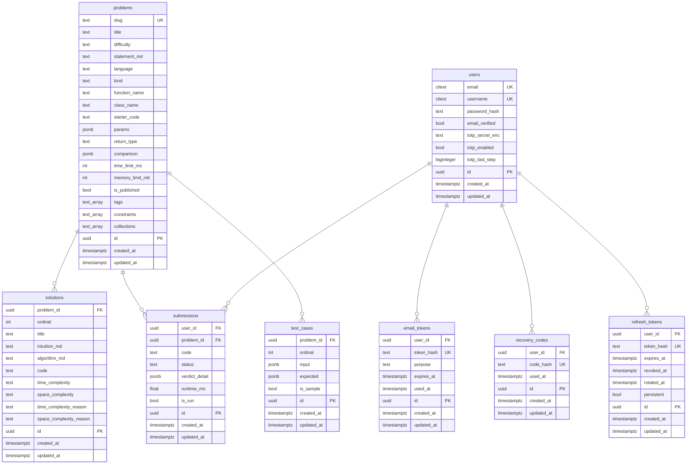

# Database schema

> Auto-generated from the SQLAlchemy models: `python -m app.cli schema-docs`.
> Do not edit by hand — re-run after changing models or migrations.

```mermaid
erDiagram
    problems {
        text slug UK
        text title
        text difficulty
        text statement_md
        text language
        text kind
        text function_name
        text class_name
        text starter_code
        jsonb params
        text return_type
        jsonb comparison
        int time_limit_ms
        int memory_limit_mb
        bool is_published
        text_array tags
        text_array constraints
        text_array collections
        uuid id PK
        timestamptz created_at
        timestamptz updated_at
    }
    users {
        citext email UK
        citext username UK
        text password_hash
        bool email_verified
        text totp_secret_enc
        bool totp_enabled
        biginteger totp_last_step
        uuid id PK
        timestamptz created_at
        timestamptz updated_at
    }
    email_tokens {
        uuid user_id FK
        text token_hash UK
        text purpose
        timestamptz expires_at
        timestamptz used_at
        uuid id PK
        timestamptz created_at
        timestamptz updated_at
    }
    recovery_codes {
        uuid user_id FK
        text code_hash UK
        timestamptz used_at
        uuid id PK
        timestamptz created_at
        timestamptz updated_at
    }
    refresh_tokens {
        uuid user_id FK
        text token_hash UK
        timestamptz expires_at
        timestamptz revoked_at
        timestamptz rotated_at
        bool persistent
        uuid id PK
        timestamptz created_at
        timestamptz updated_at
    }
    solutions {
        uuid problem_id FK
        int ordinal
        text title
        text intuition_md
        text algorithm_md
        text code
        text time_complexity
        text space_complexity
        text time_complexity_reason
        text space_complexity_reason
        uuid id PK
        timestamptz created_at
        timestamptz updated_at
    }
    submissions {
        uuid user_id FK
        uuid problem_id FK
        text code
        text status
        jsonb verdict_detail
        float runtime_ms
        bool is_run
        uuid id PK
        timestamptz created_at
        timestamptz updated_at
    }
    test_cases {
        uuid problem_id FK
        int ordinal
        jsonb input
        jsonb expected
        bool is_sample
        uuid id PK
        timestamptz created_at
        timestamptz updated_at
    }
    problems ||--o{ solutions : ""
    problems ||--o{ submissions : ""
    problems ||--o{ test_cases : ""
    users ||--o{ email_tokens : ""
    users ||--o{ recovery_codes : ""
    users ||--o{ refresh_tokens : ""
    users ||--o{ submissions : ""
```
